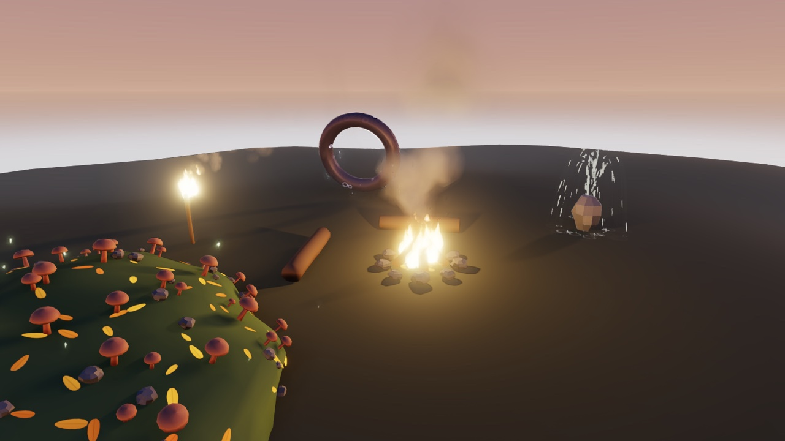
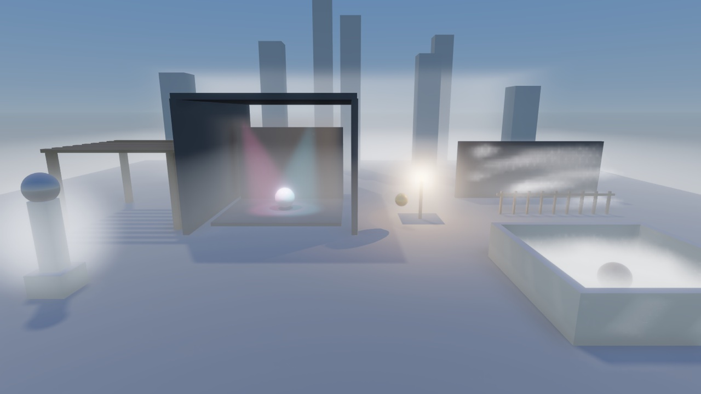
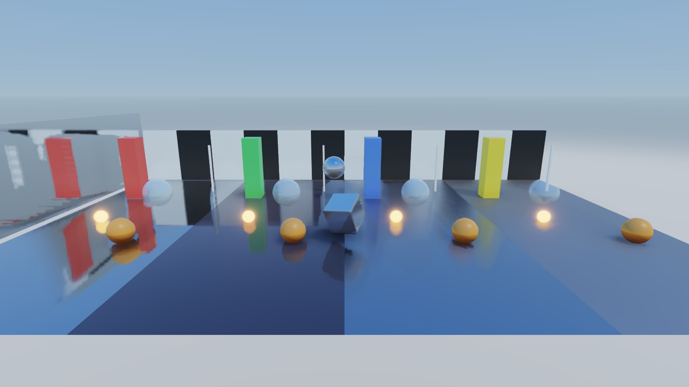
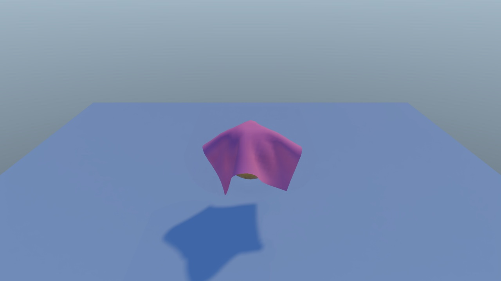
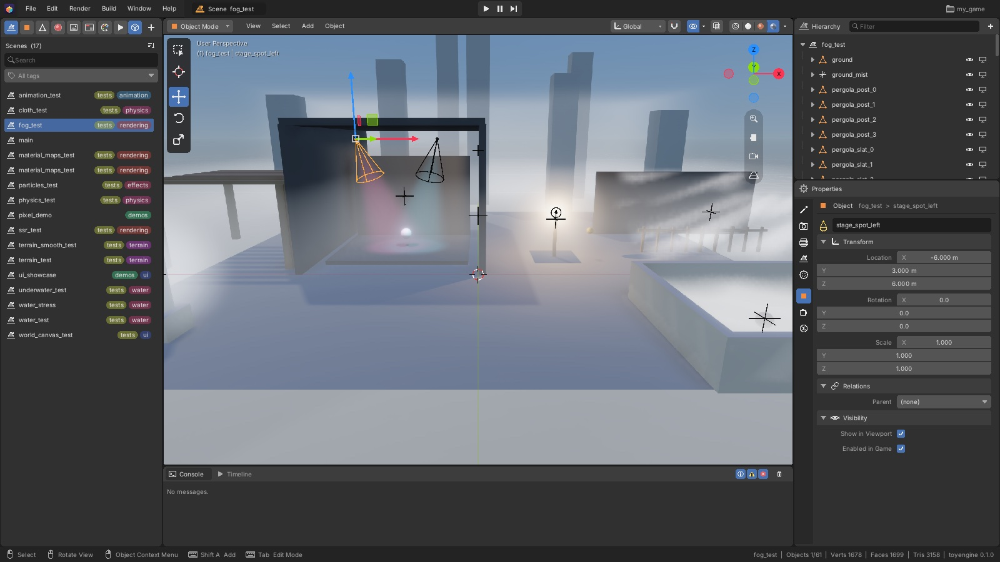
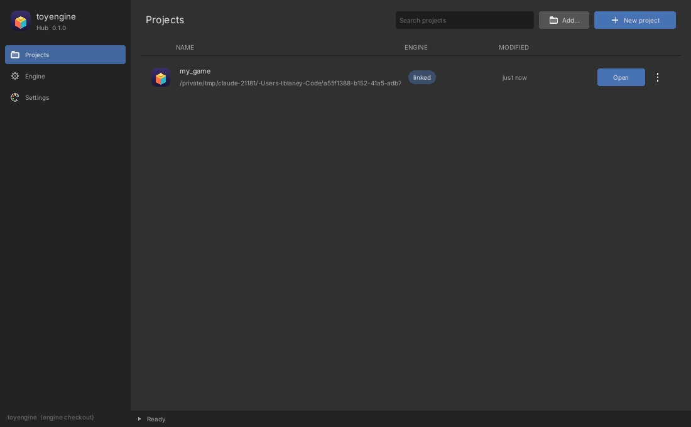
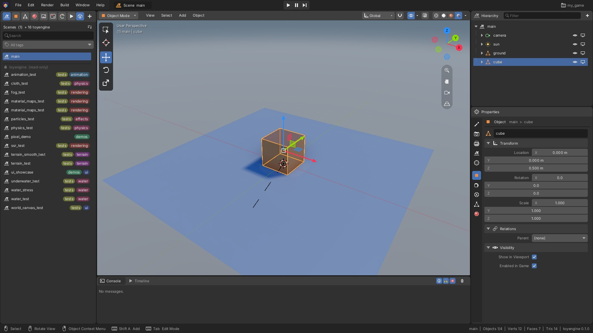

# toyengine

**A modern C++20 / Vulkan 3D game engine with a Blender-style editor.**

toyengine pairs a full-resolution deferred PBR renderer with rigid-body and cloth physics,
dynamic water, streamed procedural terrain, an interactive UI toolkit, and a native editor
that writes exactly the files the game loads. It runs on Linux and macOS (Apple Silicon,
via MoltenVK).



<table>
  <tr>
    <td></td>
    <td></td>
  </tr>
  <tr>
    <td align="center"><sub><b>water_test</b>: waves, foam, a flowing river, buoyant crates</sub></td>
    <td align="center"><sub><b>fog_test</b>: global fog, local volumes, volumetric light</sub></td>
  </tr>
  <tr>
    <td></td>
    <td></td>
  </tr>
  <tr>
    <td align="center"><sub><b>ssr_test</b>: Hi-Z screen-space reflections from mirror to rough</sub></td>
    <td align="center"><sub><b>pixel_demo</b>: PBR, refraction, SDFs, bloom</sub></td>
  </tr>
  <tr>
    <td></td>
    <td></td>
  </tr>
  <tr>
    <td align="center"><sub><b>terrain_test</b>: procedural world streamed in chunks around the camera</sub></td>
    <td align="center"><sub><b>underwater_test</b>: absorption, caustics, the surface seen from below</sub></td>
  </tr>
  <tr>
    <td></td>
    <td></td>
  </tr>
  <tr>
    <td align="center"><sub><b>physics_test</b>: bounciness, friction, stacking, hinges, triggers</sub></td>
    <td align="center"><sub><b>cloth_test</b>: XPBD cloth draped over a moving ball</sub></td>
  </tr>
</table>

## The editor



`toyengine_editor` embeds the real engine, so its **Full Render** viewport *is* the game's
renderer. It looks and feels like Blender (keymaps, gizmos, modes, outliner) and uses a
Unity-style component model:

- **Scenes and object assets.** Hierarchy, inspector, gizmos, play / pause / step in place.
  Prefab-like object assets are instanced with `prefab:`.
- **Mesh modelling.** Edit Mode has extrude, inset, bevel, loop cut and slide, bridge,
  subdivide (including Catmull-Clark), mirror and UVs. Sculpt Mode has draw, smooth, inflate,
  grab and flatten brushes, with symmetry.
- **Material lookdev.** A shader ball, studio lighting and a turntable.
- **Render and project settings,** applied live.
- **Build** makes a standalone, signed game for this platform (a `.app` on macOS, a folder on
  Linux) in a **Development** or **Shipping** profile. See [Shipping a game](#shipping-a-game).
- Snapshot undo, hot-reloading themes and a console.

Everything it saves is plain YAML in your project's `assets/` folder, so you can hand-edit,
diff and merge it. See [editor/README.md](editor/README.md) for the full tour.

## Features

### Rendering
- **Deferred PBR pipeline.** G-buffer plus Cook-Torrance lighting with directional, point and
  spot lights, an environment and sky, and texture maps (albedo, normal, roughness, metallic, AO).
- **Shadows.** Cascaded directional shadows with texel-scaled bias, cascade blending and a far
  fade; many shadowed point and spot lights in one atlas, chosen by screen importance, with
  static casters cached per light; soft PCF, optional PCSS and single-ray screen-space contact
  shadows.
- **Screen-space effects.** Hi-Z SSR with temporal accumulation, traced SSGI colour bleed and
  GTAO-style SSAO with an Unreal-like temporal filter. The G-buffer carries per-object motion
  vectors, so the AO resolve and TAA follow moving objects instead of trailing behind them.
- **Transparency and refraction.** A forward pass for blended materials, with screen-space
  refraction and Fresnel.
- **SDF raymarching.** Signed-distance-field shapes that cast shadows and mix freely with meshes.
- **Volumetrics and fog.** Raymarched local volumes with shadowed light shafts, plus global
  height fog.
- **Post-processing.** Bloom, auto exposure, colour-grading LUTs, physically based depth of
  field, tilt-shift, and anti-aliasing (TAA, SMAA or FXAA).
- **Quality presets.** Per-feature tiers in `assets/config.yaml`. Every feature has a master
  switch, and "off" really costs nothing.
- **GPU and CPU profiler.** `PROFILE=1` writes per-feature timings to CSV, and an on-screen
  stats overlay (F3, or `debug.overlay` in `config.yaml`) shows FPS, pass timings, draw,
  physics and memory stats live.
- **Optional stylisation.** Banded cel lighting, outlines, ordered dithering and palette
  quantisation are available when a project wants them.

### Simulation
- **Rigid-body physics** ([physxcoopa](libs/physxcoopa)). Box, sphere, capsule and mesh
  colliders, physics materials, hinge, ball and cone-twist joints, triggers, collision layers,
  and kinematic movers and controllers. Raycasts, shape sweeps, overlaps and penetration
  queries take one `QueryFilter` (layer mask, triggers, an ignored body, a predicate).
- **Characters** ([toyengine/scene](toyengine/scene/README.md)). `CharacterController` walks a
  capsule with collide-and-slide, steps, slope limits, jumps, moving platforms and pushing, and
  can move by animation root motion. The camera follows it in a colliding third-person orbit or
  in first person.
- **Ragdolls.** `Ragdoll` turns an animated rig into jointed physics bones that go limp on demand
  and blend back into animation.
- **Cloth.** XPBD cloth that collides with the world and renders as a shaded, shadow-casting
  mesh.
- **Water** ([toyengine/water](toyengine/water/README.md)):
  - Lakes and oceans with Gerstner waves. The same wave math runs in the shader and in a CPU
    surface query, so gameplay and visuals agree.
  - Rivers whose current comes from the mesh's own slope and bends around obstacles.
  - Shoreline and contact foam, and ripple rings from anything crossing the surface.
  - `Buoyancy` makes any rigid body float, bob on waves and drift with the current.
  - Underwater, you get fog, absorption, caustics and Snell's window.
- **Procedural terrain** ([toyengine/world](toyengine/world/README.md)):
  - A seeded [mapcoopa](libs/mapcoopa) world with elevation, biomes and rivers.
  - Meshed in chunks on the job system and streamed around the camera.
  - Tile shapes are mesh assets, so the look changes with one line of YAML.

- **Particles** ([toyengine/particles](toyengine/particles/README.md)):
  - Unity-style modules: emission rate and bursts, shapes, forces, curl-noise turbulence,
    colour/size over life, ground collision and sub emitters.
  - Blender-style mesh emission from faces, vertices or edges, oriented to the surface, plus a
    hair-like scatter mode that places instanced meshes or surface-aligned cards over a mesh.
  - Simulated on the job system; rendered as sorted, instanced quads in the transparent pass,
    with soft depth fades and HDR glow.
  - Procedural sprites with a stylized look: flame, smoke puff, spark, ring, star and leaf.

- **Weather and time of day** ([toyengine/weather](toyengine/weather/README.md)):
  - A clock moves the sun and moon, and the sky blends through day, twilight and night palettes.
  - Weather conditions (clear, rain, storm, fog, snow, sandstorm...) blend smoothly into each
    other on a fixed, random or cycling schedule. Each condition drives the sky, ambient light,
    fog, the sun, wind and lightning.
  - Runtime rain, snow, mist and dust effects follow the camera, drift with the wind and fade
    with the blend.
  - Any component can read the weather (`toy::weather::current()`) or subscribe to its signals.
    `WeatherReactor` switches lamps, fires and effects with no code.
  - The whole thing is edited per scene in the editor's World tab.

### UI and scenes
- **UI toolkit** ([uicoopa](libs/uicoopa)). Panels, text, buttons, sliders, progress bars,
  layouts and masks. Use it as a crisp screen-space HUD, or on world-space canvases that
  billboard or sit in 3D and stay clickable.
- **Data-driven scenes.** YAML scenes, object assets and shared material assets. Every loader
  also reads binary `.caml`, so a packaged project needs no path rewriting.
- **Components.** Cameras (orbit, fly, tracking, first person), movers, skinned meshes, a
  multithreaded job system and named input actions.
- **Animation** ([coopa/animation](libs/libcoopa/coopa/animation/README.md)). Keyframed and
  procedural clips with crossfades, timeline events (footsteps), root motion, and two-bone,
  look-at and foot-placement IK.
- **Async scene loading** ([toyengine/core](toyengine/core/README.md)). The next scene builds
  in the background behind a fade or a loading screen with a progress bar; `SceneLink` doors
  change levels with no code.
- **Save games** ([toyengine/save](toyengine/save/README.md)). Named slots in the player's data
  folder with a sidecar for slot menus, atomic writes, encoded in shipping builds. The engine
  decides where saves go; the game decides what is in them, through save/load signals, per-object
  `ISaveable` components keyed by `SaveId`, and version migrations. F5 / F9 quick-save and load.

### Audio
- **Mixer and 3D sound** ([sfxcoopa](libs/sfxcoopa)). WAV and MP3 clips, buses
  (Master > Music / SFX / UI), binaural panning, distance falloff and doppler.
- **Scene components.** `AudioSource` (2D or positioned, `play_on_start`, loop) and
  `AudioListener`. Without a listener, the main camera hears. `VolumeBinding` connects a
  settings-menu slider to a bus and remembers the player's choice.
- **From code.** `engine.audio().play_oneshot("audio/hit.wav")`, `set_bus_volume()` and
  `pause_all()`. UI sounds (`UiSoundPlayer`) share the same mixer.
- Headless runs and tests use a null device, so they never take over the sound card.

## Getting started

This walks you from a fresh clone to your own project running its first scene.

### 1. Clone

The coopa libraries are pinned submodules under [`libs/`](libs/). Clone them recursively,
because gfxcoopa has a nested submodule of its own:

```bash
git clone --recurse-submodules git@github.com:cooparobla/toyengine.git
cd toyengine
# already cloned?
git submodule update --init --recursive
```

### 2. Build the engine, editor and hub

**Linux.** You need the Vulkan SDK (with `glslc`), GLFW, CMake and a C++20 compiler.

**macOS (Apple Silicon).** Run `tools/setup_macos.sh` once. It installs MoltenVK, the Vulkan
loader, validation layers, `glslc` and GLFW through Homebrew.

Then, on either platform:

```bash
cmake -B build && cmake --build build -j
```

This builds the demo player (`build/toyengine`), the editor (`build/toyengine_editor`) and the
project launcher (`build/toyengine_hub`). On macOS, `tools/toyhub app` also installs a
**toyengine Hub** app in `~/Applications` that launches this build.

### 3. Create a project in the hub

```bash
./build/toyengine_hub
```

Click **New project** and fill in:

- **Name**: the project's folder name, in snake_case (`My Game` becomes `my_game`).
- **Location**: the folder to create it in.
- **Engine**: choose **Linked to a local toyengine checkout** and leave it pointing at this
  clone. The project then builds against your working tree, so nothing needs pushing first.
  (**Pinned** clones the engine at a pushed commit instead, which makes a project reproducible
  on any machine. See [Projects](#projects).)

The hub creates `<location>/<name>` from the [project template](templates/project/), links the
engine into it, and lists it:



### 4. Build it and run the starter scene

Click **Open**. A project that has never been built is built first, with the output streaming
into the hub's log drawer. That first build compiles the engine, so it takes a few minutes.
The project's own editor then opens. On first open it creates the project's `assets/`, with a
starter scene, `main`: a camera, a sun, a ground plane and a cube.



Press **Play** (the ▶ in the top bar) to run the scene inside the editor, using the game's own
renderer. To run the game itself, use the project's scripts:

```bash
cd <location>/my_game
./run.sh            # the game, on its default scene (assets/scenes/main)
./editor.sh         # the editor again, without the hub
./build.sh          # rebuild the game and editor from the command line
```

From here, add scenes and objects in the editor and C++ components in `src/`. After changing
`src/`, use **Build > Refresh** (**Shift+Ctrl+B**) in the editor to rebuild the game and the
editor. [Projects](#projects) describes the project layout, and
[Shipping a game](#shipping-a-game) covers making a standalone build.

## Exploring the engine repo

The engine repository runs on its own, with demo and test scenes in [`assets/`](assets/).

### Run a demo

```bash
./build/toyengine                  # the default scene from assets/config.yaml (pixel_demo)
./build/toyengine particles_test   # or any scene under assets/scenes/ by name
./build/toyengine path/to/scene.yaml
```

| Scene | What it shows |
|---|---|
| `pixel_demo` | Materials showcase: PBR, glass and refraction, SDFs, emissive bloom, water |
| `particles_test` | A campfire at dusk: flames, lit smoke, embers, a torch trail, mesh scatter |
| `weather_test` | A hamlet through a fast day and changing weather: rain, fog, storms, lamps at night |
| `fog_test` | Global fog, local fog volumes, volumetric spot and point lights; look toward the sun |
| `ssr_test` | Screen-space reflections (and SSGI) across mirror, glossy and rough surfaces |
| `water_test` | Lake, river, foam, ripples, buoyant crates, a raft and a circling boat |
| `underwater_test` | Underwater fog, caustics, Snell's window; scroll out to break the surface |
| `water_stress` | Benchmark: a 1 km ocean, distant lakes and 200 buoyant crates |
| `terrain_test` | Streamed procedural world. WASD moves the focus, Tab/Shift change height |
| `terrain_smooth_test` | The same streamed world with styled, smooth tiles |
| `physics_test` | Restitution, friction, stacking, joints, triggers, kinematic platforms |
| `cloth_test` | XPBD cloth draped over a moving ball |
| `ragdoll_test` | Ragdolls tumbling down stairs, shoved by a ram; R toggles the player's ragdoll |
| `animation_test` | Clip-driven rigs: an object-hierarchy robot arm, a skinned tentacle, a bouncing ball, two-bone and look-at IK |
| `character_test` | A third-person mannequin (WASD, Space, Shift) on stairs, ramps, platforms and crates; foot IK; F5 / F9 save and load |
| `loading_test` | Doors that load a heavy scene in the background behind a loading screen or a fade |
| `ui_showcase` | A game HUD over a small scene, with a world-space nameplate |
| `world_canvas_test` | World-space and screen-space UI, with a clickable health bar |
| `material_maps_test` | Texture-mapped vs. flat materials (`scene_mapped.yaml` / `scene_flat.yaml`) |

Default controls: the mouse orbits the camera (the cursor is captured), the scroll wheel zooms,
and Esc quits.

### Open the editor on the engine repo

```bash
./build/toyengine_editor                       # most recent project, else this repo's assets/
./build/toyengine_editor path/to/project       # any folder containing assets/
./build/toyengine_editor --new-project ~/game  # scaffold a new project with a starter scene
```

### Write a scene by hand

Scenes are a tree of objects with components. The engine is **Z-up**, in metres.

```yaml
format: blender
scene:
  scene_name: hello
  root_objects:
    - name: camera
      components:
        - type: Transform
          position: { x: 0.0, y: -10.0, z: 6.0 }
          rotation: { x: 68.0, y: 0.0, z: 0.0 }
        - type: Camera
          main: true
          fov: 50.0
    - name: sun
      components:
        - type: Transform
        - type: DirectionalLight
          direction: { x: -0.35, y: -0.45, z: -0.82 }
          cast_shadows: true
    - name: ball
      components:
        - type: Transform
          position: { x: 0.0, y: 0.0, z: 4.0 }
          scale: { x: 0.5, y: 0.5, z: 0.5 }
        - type: MeshRenderer
          mesh_path: sphere
          material: { albedo: { r: 0.8, g: 0.3, b: 0.2 }, roughness: 0.4 }
        - type: SphereCollider
          radius: 1.0
        - type: Rigidbody
          mass: 1.0
```

The scenes in [`assets/scenes/`](assets/scenes/) are heavily commented and are the best
reference for every component. Rendering is configured in
[`assets/config.yaml`](assets/config.yaml), with a comment on every key.

## Projects

A game lives in its own **project** folder, which builds this engine from
`<project>/.libs/toyengine` alongside the project's own C++ and assets.
[Getting started](#getting-started) creates one with the hub; `tools/toyhub` does the same from
the command line:

```sh
tools/toyhub new ~/Games/my_game --link    # or: --ref <pushed commit>; default pins this HEAD
                                           # (toyhub add <folder> adopts an existing folder)
cd ~/Games/my_game
./build.sh                                 # game (build/my_game) + editor (build/my_game_editor);
                                           # later rebuilds: the editor's Build > Refresh
./editor.sh                                # first open creates assets/
./run.sh [scene]                           # HEADLESS=1 MAX_FRAMES=600 ./run.sh for no window
./package.sh dev                           # standalone game: build/dist/development/
./package.sh ship                          # Release, encoded, signed (+ notarized): build/dist/shipping
```

A project contains:

| Path | What |
|---|---|
| `<target>.toy` | The project file (YAML): `target` (the executable name) and `engine:`, which holds `source` (`git@github.com:cooparobla/toyengine.git`), `ref` (the pinned commit) and optionally `link` (a local engine checkout). |
| `assets/` | The project's content. It sits over this repo's `assets/`, which is the fallback for shaders, fonts, shared meshes and materials. `assets/shaders/*` compile with the engine and gfxcoopa shader headers on the include path. |
| `src/` | C++ compiled into both the game and the editor, so the editor's Play runs it. Register components with `TOY_MODULE` ([`toyengine/core/module.h`](toyengine/core/module.h)). Describe them to the inspector with `register_component_schema()` under `#if TOY_EDITOR`. `src/main.cpp` replaces the game's `main`. Engine code is a compiled library, so changing it means editing (or forking) the engine checkout. |
| `.libs/toyengine` | The engine and its submodules. `setup.sh` clones it at `engine.ref`, or symlinks it to `engine.link`. Git-ignored. |
| `setup.sh build.sh run.sh editor.sh package.sh clean.sh` | The project's scripts (from [`templates/project/`](templates/project/)). |
| `build_settings.yaml` | Build Settings: product name, version, bundle id, signing. Written by the editor; never shipped. |

A **linked** project builds against this working tree directly, uncommitted edits in the engine
and `libs/` included. This is how to work on the engine and a game together. Everything it
builds goes into the project's own `build/`, compiled shaders included (`build/shaders/`), so
building a linked project never writes into the engine checkout or its `build/`. A **pinned**
project clones the engine at a pushed commit, which makes it reproducible on any machine.
`toyhub link|unlink <dir>` switches between the two, and `toyhub upgrade <dir> [--ref R]`
re-pins. When a project's build is broken and it won't open, `toyhub rebuild <dir>` (the hub's
**...** > **Rebuild (clean)**) removes its build output and builds it again. The CMake side is [`cmake/ToyProject.cmake`](cmake/ToyProject.cmake)
(`toyengine_add_project()`). When `.libs/toyengine` is not the top-level build, it adds only the
engine; its own tests and tools are skipped.

### Shipping a game

**Build** in the editor's **Build** menu (or `./package.sh dev|ship`, or
`toyengine_editor <project> --build dev|ship [--out <dir>]`) makes a game that runs from
anywhere. It doesn't need this repo, Homebrew or the Vulkan SDK on the player's machine.

| | Development | Shipping |
|---|---|---|
| Compiled | the editor's own build tree, incrementally | a separate Release tree, `build-ship/`, with `TOY_SHIPPING=ON` |
| Assets | plain YAML | encoded `.caml` (the key can be compiled in) |
| Debug hooks | `HEADLESS`, `SCENE`, `CAPTURE_*`, validation layers... | all off; no screenshot on exit |
| macOS signing | ad-hoc | Developer ID + hardened runtime, notarized and stapled (ad-hoc if no identity is set up) |
| Archive | none | `.zip` (and optionally a `.dmg`) / `.tar.gz` |

What the build contains:
- **macOS.** A `.app`. It bundles GLFW, libcrypto, the Vulkan loader, MoltenVK and its ICD
  manifest under `Contents/Frameworks`, and every library path is rewritten to `@rpath`.
- **Linux.** A folder with `lib/` (`$ORIGIN/lib`) and a launcher. It uses the system's Vulkan
  loader and drivers.
- **Assets.** The project's assets are merged with the engine's runtime files (shaders from
  every library, fonts, UI themes and default sounds).
- **Logs and crashes.** The packaged game writes its log and crash reports to
  `~/Library/Logs/<bundle id>/` (Linux: `$XDG_STATE_HOME`).
- **Player data.** Player settings go in `~/Library/Application Support/<bundle id>/`.

Per-project choices live in `build_settings.yaml` (**Build > Build Settings...**). It holds
the product name, version, bundle id, icon, signing identity and notary profile, and it is
never shipped. To notarize, store your App Store Connect credentials once with
`xcrun notarytool store-credentials <profile>`, then put that profile name in Build Settings.
Builds target the machine you build on. There is no cross-compiling.

### toyengine Hub

`build/toyengine_hub` (source in [`hub/`](hub/)) is a small launcher that lists, creates, adds,
opens, re-pins and removes projects. It is drawn with the editor's UI and themes
and calls `tools/toyhub` for everything. Build output streams into its log drawer.

- A project's name is always its folder's name. **New project** takes a name and a location and
  creates `<location>/<name>`. **Add** takes any folder. A folder that already has a `.toy` is
  listed as it is. One without a `.toy` is set up as a new project in place, and no existing file
  is overwritten. Both ask for the project's options: the engine (**Pinned** to a commit, or
  **Linked** to any local toyengine checkout) and whether to fetch or link the engine now.
- **Open** opens the project in its editor. A project that has never been built is built
  first, with the output in the log. After that, building is the editor's job: **Build >
  Refresh** (**Shift+Ctrl+B**) rebuilds the game and editor after `src/` changes and offers to
  relaunch the editor.
- The **...** menu has Open in Editor, Reveal in Finder, re-pin or link the engine, and **Remove
  Project...**. Remove asks first, then either moves the folder to the Trash (`toyhub delete`) or
  only removes it from the list.
- Nothing is auto-detected. The hub lists only the projects you created or added through it or
  `toyhub`. The engine checkout itself is never a project.
- The hub keeps its data in `~/.toyengine/`: `projects.yaml` (the list, shared with `toyhub`) and
  `settings.yaml` (its theme, `blender_dark` by default, separate from the editor's).

```sh
cmake --build build --target toyengine_hub && ./build/toyengine_hub
tools/toyhub app        # macOS: ~/Applications/toyengine Hub.app (a launcher for that build)
tools/toyhub install    # ~/.local/bin/toyhub for the CLI
tools/toyhub list       # listed projects (~/.toyengine/projects.yaml)
```

## Testing and headless runs

```bash
ctest --test-dir build -j4                         # engine + editor suites
ctest --test-dir build -L unit -j4                 # the fast tier (also: -L gpu, -R <suite>)
./build/tests/toyengine_tests --list               # suites and their tests
./build/tests/toyengine_tests --suite water_waves  # one suite
./build/tests/toyengine_editor_tests --suite undo_stack
```

Render tests use a never-mapped window, so a full run is invisible on your desktop. You can
also script the engine:

```bash
HEADLESS=1 MAX_FRAMES=600 ./build/toyengine terrain_test   # benchmark, then save output/frame.png
ONESHOT=1 ./build/toyengine                                # render one frame and exit
HEADLESS=1 PROFILE=1 MAX_FRAMES=600 ./build/toyengine      # per-feature timings -> output/profile.csv
```

`FIXED_DT`, `NO_INPUT`, `CAPTURE_FRAMES`, `SCENE` and `CONFIG` make captures reproducible. See
the docs on `Engine::run()` in [toyengine/core/engine.h](toyengine/core/engine.h).

## Project layout

```
toyengine/
├── core/       Engine, AppConfig, caml codec, branding
├── render/     the render pipeline, its config, profiler, and passes/
├── scene/      gameplay components: camera controller, movers, cloth & skinned renderers
├── particles/  ParticleSystem, LightFlicker, the particle simulation
├── audio/      AudioSource / AudioListener components and the audio system
├── ui/         UI asset helpers: open/close a screen, UiController widget bindings
├── world/      streamed procedural tile terrain
└── water/      WaterBody, Buoyancy, WaterSystem
editor/         toyengine_editor: app, documents & undo, schemas, mesh modelling, viewport, packager
hub/            toyengine_hub: the project launcher (a GUI over tools/toyhub)
templates/      project/: the files `toyhub new` / `toyhub add` create a project from
cmake/          ToyProject.cmake: toyengine_add_project() (game + editor for a project dir)
assets/         config.yaml, scenes, meshes, materials, textures, shaders (every one the engine loads), fonts
docs/           hand-written guides (e.g. ambient lighting); docs/images holds these screenshots
libs/           pinned submodules: libcoopa (scene graph, assets, jobs), gfxcoopa (Vulkan),
                physxcoopa (physics), sfxcoopa, uicoopa (UI), mapcoopa (world gen), caml
```

Each module has its own README with the details.

`toyengine/` and `editor/` are compiled once, as the static libraries `toyengine::engine` and
`toyengine::editor`. Each header declares, and its `.cpp` beside it holds the function bodies and
the includes only those bodies need. Templates, constexpr code and the small hot math headers
(`toy_render_math.h`, `particle_math.h`, `water_waves.h`, `tile_topology.h`, ...) stay inline. A
game, editor or test source then compiles only its own code, so editing an engine `.cpp`
rebuilds that one file and relinks. The `libs/` submodules are still header-only.

## Platform notes

- **macOS.** Use the plain CMake path; `cbuild`/`cplay` are Linux-only workspace tools.
  - Plain `cmake -B build` configures a Release build here. Pass `-DCMAKE_BUILD_TYPE=Debug`
    to get validation layers.
  - MoltenVK has no MAILBOX present mode, so presentation is always FIFO.
  - Seeded worlds are byte-identical to Linux. mapcoopa ships its own libstdc++-exact random
    and sort functions and builds with `-ffp-contract=off`.
- **SMAA lookup textures** are fetched at configure time unless `SMAA_TEXTURES_DIR` points at
  a checkout.
- **Working inside `libs/`.** Each library still builds standalone in place. Submodules check
  out a detached HEAD, so run `git submodule foreach git checkout main` before committing to
  one. A toyengine build compiles every shader -- the libraries' too -- into its own
  `build/shaders/<target>/`, never next to the sources; a library's standalone build still
  compiles in place (and uicoopa's commits its `.spv`).

## Documentation

- Per-module READMEs: [core](toyengine/core/README.md), [render](toyengine/render/README.md),
  [scene](toyengine/scene/README.md), [particles](toyengine/particles/README.md),
  [world](toyengine/world/README.md), [water](toyengine/water/README.md),
  [editor](editor/README.md), [assets](assets/README.md).
- [`docs/editor/`](docs/editor/README.md) is the editor's user manual.
- [`docs/`](docs/) holds hand-written guides to specific engine behaviour.
- `.docs/` is the generated HTML API reference, built from in-source docstrings with
  `coopadocs build`.
