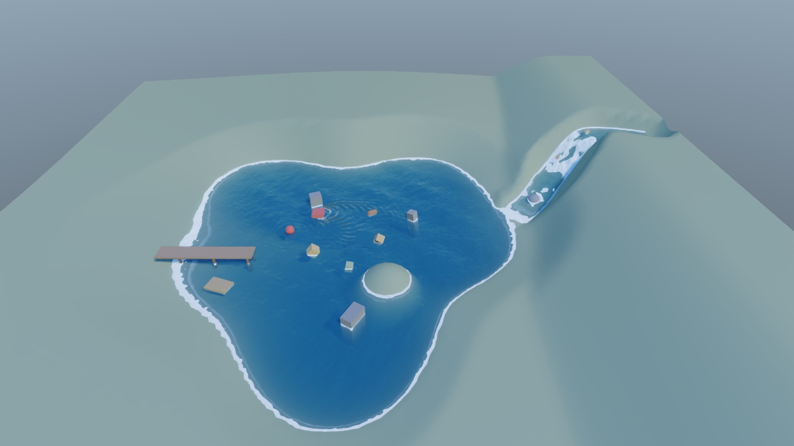
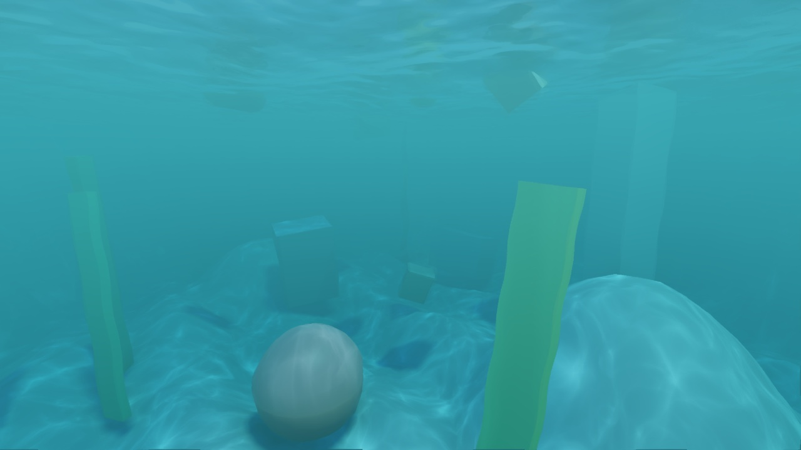
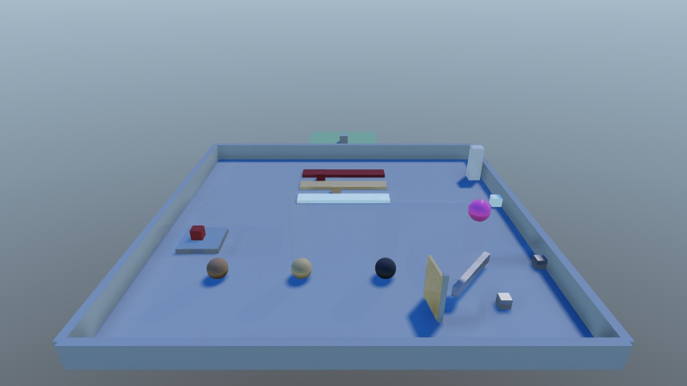
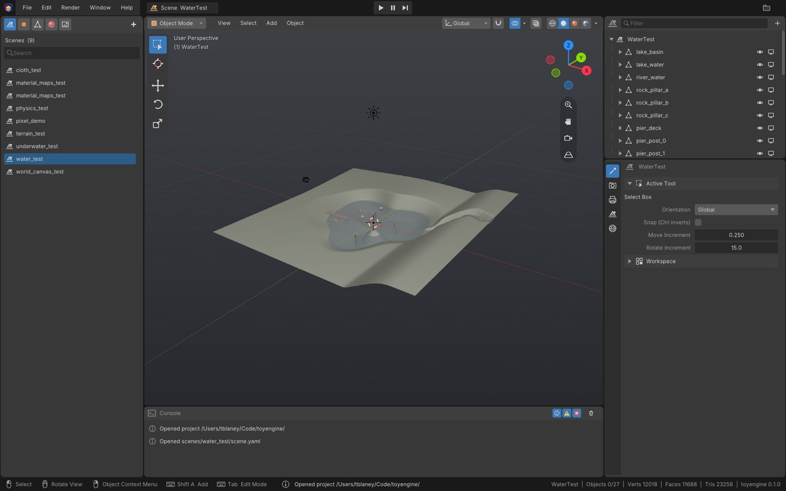

# toyengine

**A modern C++20 / Vulkan 3D game engine with a Blender-style editor.**

toyengine pairs a full-resolution deferred PBR renderer with rigid-body and cloth physics,
dynamic water, streamed procedural terrain, an interactive UI toolkit, and a native editor
that writes exactly the files the game loads. It runs on Linux and macOS (Apple Silicon,
via MoltenVK).



<table>
  <tr>
    <td></td>
    <td></td>
  </tr>
  <tr>
    <td align="center"><sub><b>terrain_test</b>: procedural world streamed in chunks around the camera</sub></td>
    <td align="center"><sub><b>underwater_test</b>: absorption, caustics, the surface seen from below</sub></td>
  </tr>
  <tr>
    <td></td>
    <td></td>
  </tr>
  <tr>
    <td align="center"><sub><b>pixel_demo</b>: PBR, refraction, SDFs, bloom, SSR</sub></td>
    <td align="center"><sub><b>physics_test</b>: bounciness, friction, stacking, hinges, triggers</sub></td>
  </tr>
</table>

## The editor



`toyengine_editor` embeds the real engine, so its **Full Render** viewport *is* the game's
renderer. It looks and feels like Blender (keymaps, gizmos, modes, outliner) and uses a
Unity-style component model:

- **Scenes and object assets.** Hierarchy, inspector, gizmos, play / pause / step in place.
  Prefab-like object assets are instanced with `prefab:`.
- **Mesh modelling.** Edit Mode has extrude, inset, bevel, loop cut and slide, bridge,
  subdivide (including Catmull-Clark), mirror and UVs. Sculpt Mode has draw, smooth, inflate,
  grab and flatten brushes, with symmetry.
- **Material lookdev.** A shader ball, studio lighting and a turntable.
- **Render and project settings,** applied live.
- **Build > Package** turns a project into compact `.caml` binaries.
- Snapshot undo, hot-reloading themes and a console.

Everything it saves is plain YAML in your project's `assets/` folder, so you can hand-edit,
diff and merge it. See [editor/README.md](editor/README.md) for the full tour.

## Features

### Rendering
- **Deferred PBR pipeline.** G-buffer plus Cook-Torrance lighting with directional, point and
  spot lights, an environment and sky, and texture maps (albedo, normal, roughness, metallic, AO).
- **Shadows.** Cascaded directional and point/spot shadows, soft PCF, optional PCSS contact
  hardening and screen-space contact shadows.
- **Screen-space effects.** Hi-Z SSR with temporal accumulation, traced SSGI colour bleed and
  temporally stable SSAO.
- **Transparency and refraction.** A forward pass for blended materials, with screen-space
  refraction and Fresnel.
- **SDF raymarching.** Signed-distance-field shapes that cast shadows and mix freely with meshes.
- **Volumetrics and fog.** Raymarched local volumes with shadowed light shafts, plus global
  height fog.
- **Post-processing.** Bloom, auto exposure, colour-grading LUTs, physically based depth of
  field, tilt-shift, and anti-aliasing (TAA, SMAA or FXAA).
- **Quality presets.** Per-feature tiers in `assets/config.yaml`. Every feature has a master
  switch, and "off" really costs nothing.
- **GPU and CPU profiler.** `PROFILE=1` writes per-feature timings to CSV.
- **Optional stylisation.** Banded cel lighting, outlines, ordered dithering and palette
  quantisation are available when a project wants them.

### Simulation
- **Rigid-body physics** ([physxcoopa](libs/physxcoopa)). Box, sphere, capsule and mesh
  colliders, physics materials, hinge joints, triggers, collision layers, and kinematic movers and controllers.
- **Cloth.** XPBD cloth that collides with the world and renders as a shaded, shadow-casting
  mesh.
- **Water** ([toyengine/water](toyengine/water/README.md)):
  - Lakes and oceans with Gerstner waves. The same wave math runs in the shader and in a CPU
    surface query, so gameplay and visuals agree.
  - Rivers whose current comes from the mesh's own slope and bends around obstacles.
  - Shoreline and contact foam, and ripple rings from anything crossing the surface.
  - `Buoyancy` makes any rigid body float, bob on waves and drift with the current.
  - Underwater, you get fog, absorption, caustics and Snell's window.
- **Procedural terrain** ([toyengine/world](toyengine/world/README.md)):
  - A seeded [mapcoopa](libs/mapcoopa) world with elevation, biomes and rivers.
  - Meshed in chunks on the job system and streamed around the camera.
  - Tile shapes are mesh assets, so the look changes with one line of YAML.

### UI and scenes
- **UI toolkit** ([uicoopa](libs/uicoopa)). Panels, text, buttons, sliders, progress bars,
  layouts and masks. Use it as a crisp screen-space HUD, or on world-space canvases that
  billboard or sit in 3D and stay clickable.
- **Data-driven scenes.** YAML scenes, object assets and shared material assets. Every loader
  also reads binary `.caml`, so a packaged project needs no path rewriting.
- **Components.** Cameras (orbit, fly, tracking), movers, skinned meshes, a multithreaded job
  system and named input actions.

## Getting started

### 1. Clone

The coopa libraries are pinned submodules under [`libs/`](libs/). Clone them recursively,
because gfxcoopa has a nested submodule of its own:

```bash
git clone --recurse-submodules git@github.com:cooparobla/toyengine.git
# already cloned?
git submodule update --init --recursive
```

### 2. Build

**Linux.** You need the Vulkan SDK (with `glslc`), GLFW, CMake and a C++20 compiler:

```bash
cmake -B build && cmake --build build -j
```

**macOS (Apple Silicon).** A one-time script installs MoltenVK, the Vulkan loader, validation
layers, `glslc` and GLFW through Homebrew:

```bash
tools/setup_macos.sh
cmake -B build && cmake --build build -j
```

### 3. Run a demo

```bash
./build/toyengine                  # the default scene from assets/config.yaml
./build/toyengine water_test       # or any scene under assets/scenes/ by name
./build/toyengine path/to/scene.yaml
```

| Scene | What it shows |
|---|---|
| `pixel_demo` | Materials showcase: PBR, glass and refraction, SDFs, emissive bloom, water |
| `water_test` | Lake, river, foam, ripples, buoyant crates, a raft and a circling boat |
| `underwater_test` | Underwater fog, caustics, Snell's window; scroll out to break the surface |
| `terrain_test` | Streamed procedural world. WASD moves the focus, Tab/Shift change height |
| `physics_test` | Restitution, friction, stacking, joints, triggers, kinematic platforms |
| `cloth_test` | XPBD cloth draped over a moving ball |
| `world_canvas_test` | World-space and screen-space UI, with a clickable health bar |
| `material_maps_test` | Texture-mapped vs. flat materials (`scene_mapped.yaml` / `scene_flat.yaml`) |

Default controls: the mouse orbits the camera (the cursor is captured), the scroll wheel zooms, and Esc quits.

### 4. Open the editor

```bash
./build/toyengine_editor                       # most recent project, else this repo's assets/
./build/toyengine_editor path/to/project       # any folder containing assets/
./build/toyengine_editor --new-project ~/game  # scaffold a new project with a starter scene
```

### 5. Write a scene by hand

Scenes are a tree of objects with components. The engine is **Z-up**, in metres.

```yaml
format: blender
scene:
  scene_name: hello
  root_objects:
    - name: camera
      components:
        - type: Transform
          position: { x: 0.0, y: -10.0, z: 6.0 }
          rotation: { x: 68.0, y: 0.0, z: 0.0 }
        - type: Camera
          main: true
          fov: 50.0
    - name: sun
      components:
        - type: Transform
        - type: DirectionalLight
          direction: { x: -0.35, y: -0.45, z: -0.82 }
          cast_shadows: true
    - name: ball
      components:
        - type: Transform
          position: { x: 0.0, y: 0.0, z: 4.0 }
          scale: { x: 0.5, y: 0.5, z: 0.5 }
        - type: MeshRenderer
          mesh_path: sphere
          material: { albedo: { r: 0.8, g: 0.3, b: 0.2 }, roughness: 0.4 }
        - type: SphereCollider
          radius: 1.0
        - type: Rigidbody
          mass: 1.0
```

The scenes in [`assets/scenes/`](assets/scenes/) are heavily commented and are the best
reference for every component. Rendering is configured in
[`assets/config.yaml`](assets/config.yaml), with a comment on every key.

## Projects

This repository builds and tests on its own, with the demo scenes in `assets/`. A game lives in
its own **project** folder, which builds this engine from `<project>/.libs/toyengine` alongside
the project's own C++ and assets.

```sh
tools/toyhub new ~/Games/MyGame --link     # or: --ref <pushed commit>; default pins this HEAD
                                           # (toyhub add <folder> adopts an existing folder)
cd ~/Games/MyGame
./build.sh                                 # game (build/mygame) + editor (build/mygame_editor);
                                           # later rebuilds: the editor's Build > Refresh
./editor.sh                                # first open creates assets/
./run.sh [scene]                           # HEADLESS=1 MAX_FRAMES=600 ./run.sh for no window
./package.sh dist                          # .caml assets + engine runtime files + game binary
```

A project contains:

| Path | What |
|---|---|
| `<target>.toy` | The project file (YAML): `target` (the executable name) and `engine:`, which holds `source` (`git@github.com:cooparobla/toyengine.git`), `ref` (the pinned commit) and optionally `link` (a local engine checkout). |
| `assets/` | The project's content. It sits over this repo's `assets/`, which is the fallback for shaders, fonts, shared meshes and materials. `assets/shaders/*` compile with the engine and gfxcoopa shader headers on the include path. |
| `src/` | C++ compiled into both the game and the editor, so the editor's Play runs it. Register components with `TOY_MODULE` ([`toyengine/core/module.h`](toyengine/core/module.h)). Describe them to the inspector with `register_component_schema()` under `#if TOY_EDITOR`. `src/main.cpp` replaces the game's `main`. `src/toyengine/<path>.h` replaces that engine header, and must keep its API. |
| `.libs/toyengine` | The engine and its submodules. `setup.sh` clones it at `engine.ref`, or symlinks it to `engine.link`. Git-ignored. |
| `setup.sh build.sh run.sh editor.sh package.sh clean.sh` | The project's scripts (from [`templates/project/`](templates/project/)). |

A **linked** project builds against this working tree directly, uncommitted edits in the engine
and `libs/` included. This is how to work on the engine and a game together. A **pinned**
project clones the engine at a pushed commit, which makes it reproducible on any machine.
`toyhub link|unlink <dir>` switches between the two, and `toyhub upgrade <dir> [--ref R]`
re-pins. The CMake side is [`cmake/ToyProject.cmake`](cmake/ToyProject.cmake)
(`toyengine_add_project()`). When `.libs/toyengine` is not the top-level build, it adds only the
engine; its own tests and tools are skipped.

### toyengine Hub

`build/toyengine_hub` (source in [`hub/`](hub/)) is a small launcher that lists, creates, adds,
opens, re-pins and removes projects. It is drawn with the editor's UI and themes
and calls `tools/toyhub` for everything. Build output streams into its log drawer.

- A project's name is always its folder's name. **New project** takes a name and a location and
  creates `<location>/<name>`. **Add** takes any folder. A folder that already has a `.toy` is
  listed as it is. One without a `.toy` is set up as a new project in place, and no existing file
  is overwritten. Both ask for the project's options: the engine (**Pinned** to a commit, or
  **Linked** to any local toyengine checkout) and whether to fetch or link the engine now.
- **Open** opens the project in its editor. A project that has never been built is built
  first, with the output in the log. After that, building is the editor's job: **Build >
  Refresh** (**Shift+Ctrl+B**) rebuilds the game and editor after `src/` changes and offers to
  relaunch the editor.
- The **...** menu has Open in Editor, Reveal in Finder, re-pin or link the engine, and **Remove
  Project...**. Remove asks first, then either moves the folder to the Trash (`toyhub delete`) or
  only removes it from the list.
- Nothing is auto-detected. The hub lists only the projects you created or added through it or
  `toyhub`. The engine checkout itself is never a project.
- The hub keeps its data in `~/.toyengine/`: `projects.yaml` (the list, shared with `toyhub`) and
  `settings.yaml` (its theme, `blender_dark` by default, separate from the editor's).

```sh
cmake --build build --target toyengine_hub && ./build/toyengine_hub
tools/toyhub app        # macOS: ~/Applications/toyengine Hub.app (a launcher for that build)
tools/toyhub install    # ~/.local/bin/toyhub for the CLI
tools/toyhub list       # listed projects (~/.toyengine/projects.yaml)
```

## Testing and headless runs

```bash
ctest --test-dir build -j4                         # engine + editor suites
./build/toyengine_tests --list                     # tests and groups
./build/toyengine_tests --group scene              # one group
./build/toyengine_editor_tests                     # editor suite
```

Render tests use a never-mapped window, so a full run is invisible on your desktop. You can
also script the engine:

```bash
HEADLESS=1 MAX_FRAMES=600 ./build/toyengine terrain_test   # benchmark, then save output/frame.png
ONESHOT=1 ./build/toyengine                                # render one frame and exit
HEADLESS=1 PROFILE=1 MAX_FRAMES=600 ./build/toyengine      # per-feature timings -> output/profile.csv
```

`FIXED_DT`, `NO_INPUT`, `CAPTURE_FRAMES`, `SCENE` and `CONFIG` make captures reproducible. See
the docs on `Engine::run()` in [toyengine/core/engine.h](toyengine/core/engine.h).

## Project layout

```
toyengine/
├── core/       Engine, AppConfig, caml codec, branding
├── render/     the render pipeline, its config, profiler, and passes/
├── scene/      gameplay components: camera controller, movers, cloth & skinned renderers
├── world/      streamed procedural tile terrain
└── water/      WaterBody, Buoyancy, WaterSystem
editor/         toyengine_editor: app, documents & undo, schemas, mesh modelling, viewport, packager;
hub/            toyengine_hub: the project launcher (a GUI over tools/toyhub)
templates/      project/: the files `toyhub new` / `toyhub add` create a project from
cmake/          ToyProject.cmake: toyengine_add_project() (game + editor for a project dir)
assets/         config.yaml, scenes, meshes, materials, textures, shaders, fonts
docs/           hand-written guides (e.g. ambient lighting); docs/images holds these screenshots
libs/           pinned submodules: libcoopa (scene graph, assets, jobs), gfxcoopa (Vulkan),
                physxcoopa (physics), sfxcoopa, uicoopa (UI), mapcoopa (world gen), caml
```

Each module has its own README with the details.

## Platform notes

- **macOS.** Use the plain CMake path; `cbuild`/`cplay` are Linux-only workspace tools.
  - Plain `cmake -B build` configures a Release build here. Pass `-DCMAKE_BUILD_TYPE=Debug`
    to get validation layers.
  - MoltenVK has no MAILBOX present mode, so presentation is always FIFO.
  - Seeded worlds are byte-identical to Linux. mapcoopa ships its own libstdc++-exact random
    and sort functions and builds with `-ffp-contract=off`.
- **SMAA lookup textures** are fetched at configure time unless `SMAA_TEXTURES_DIR` points at
  a checkout.
- **Working inside `libs/`.** Each library still builds standalone in place. Submodules check
  out a detached HEAD, so run `git submodule foreach git checkout main` before committing to
  one. Building `uicoopa` in place touches three tracked depfiles;
  `git -C libs/uicoopa checkout -- .` clears them.

## Documentation

- Per-module READMEs: [core](toyengine/core/README.md), [render](toyengine/render/README.md),
  [scene](toyengine/scene/README.md), [world](toyengine/world/README.md),
  [water](toyengine/water/README.md), [editor](editor/README.md).
- [`docs/`](docs/) holds hand-written guides to specific engine behaviour.
- `.docs/` is the generated HTML API reference, built from in-source docstrings with
  `coopadocs build`.
