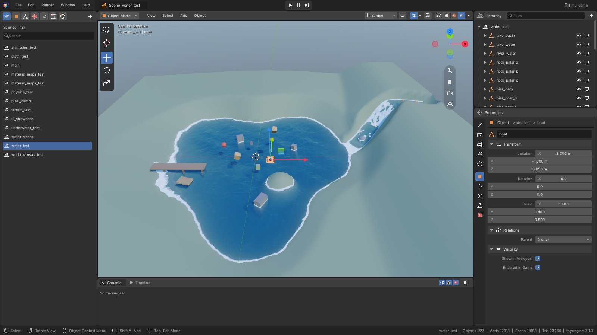
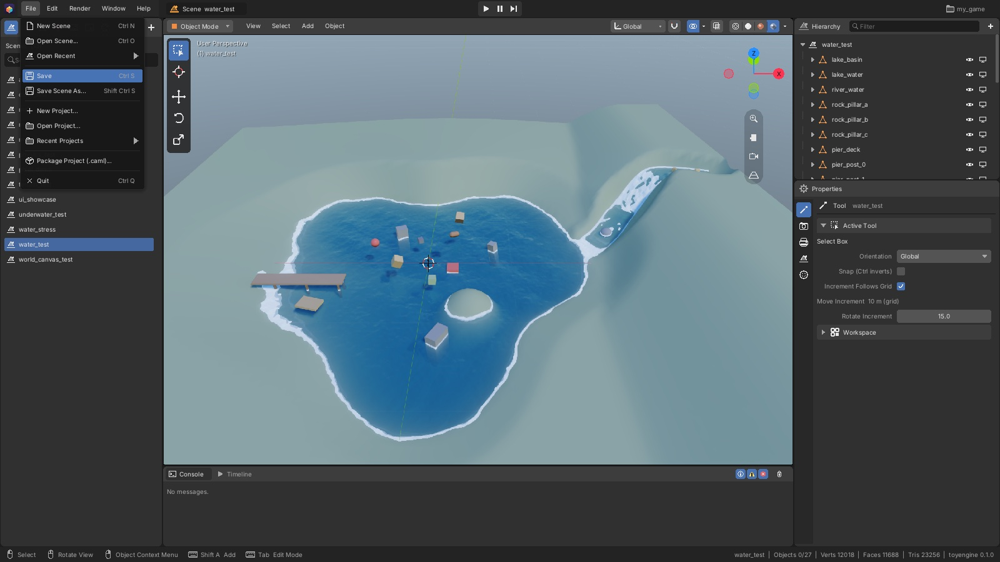
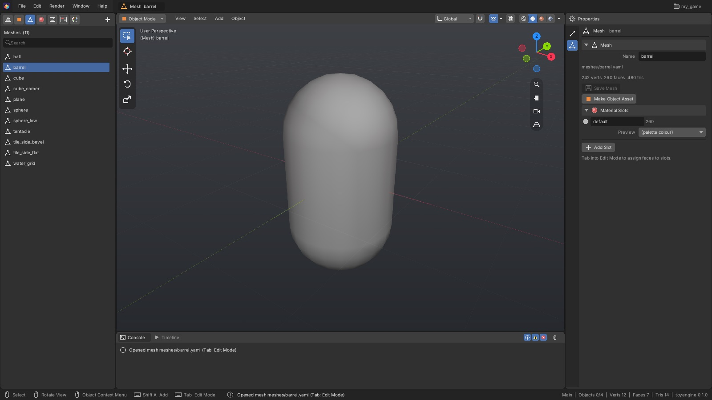
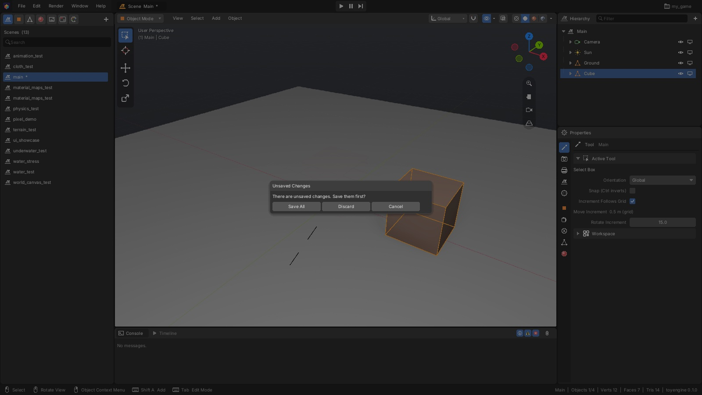
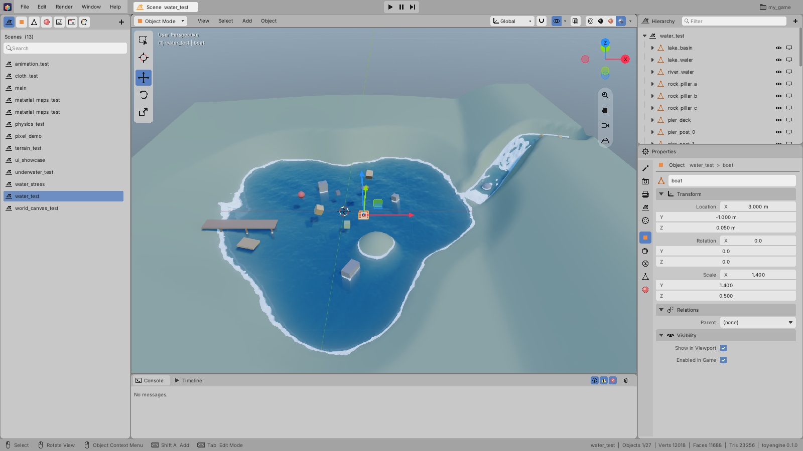

[Editor manual](README.md) > Interface

This page is a tour of the editor window: what each area is for, what is in every menu, and how
to change the editor's colours. You work on one asset at a time (a scene, an object, a mesh, a
material, a texture or a UI). Whatever you pick in the Asset panel fills the rest of the window.

The window has seven areas:

1. **Top bar** (top edge). The logo, the **File**, **Edit**, **Render**, **Window** and **Help**
   menus, the name of the open asset (here **Scene water_test**), the **Play**, **Pause** and
   **Step** buttons in the centre, and the project name (**my_game**) on the right.
2. **Asset panel** (left). A row of icon tabs, one per asset type, and the list of the project's
   assets of that type. Here the **Scenes** tab is open and **water_test** is highlighted.
3. **Viewport** (centre). The 3D view of the open asset, with its header (**Object Mode**,
   **View**, **Select**, **Add**, **Object** and the display buttons) and the tool strip on its
   left edge. See [Viewport](viewport.md).
4. **Console and Timeline** (under the viewport). Messages from the editor, or the animation
   Timeline. See [Animation](animation.md#open-the-timeline) for the Timeline.
5. **Hierarchy** (top right). The objects in the open scene, as a tree.
6. **Properties** (bottom right). A column of icon tabs and the settings of the tab you pick.
   Here the **Object** tab shows the selected object, **boat**.
7. **Status bar** (bottom edge). Mouse and key hints on the left, scene statistics on the right.

## Resize and rearrange the areas

- To resize an area, drag the thin gap between two areas.
- To give the whole window to the viewport, point at the viewport and press **Ctrl+Space**
  (**Window > Toggle Maximize Area**). Press it again to bring the other areas back.
- To hide or show the Console and Timeline, choose **Window > Console**.
- To put everything back the way it started, choose **Window > Reset Layout**.

The Hierarchy only appears while a scene, an object or a UI is open. For a mesh, material or
texture, Properties fills the whole right side.

## Use the menus

Click a menu name in the top bar to open it. Shortcuts are listed at the right of each item.
Items that are greyed out can't be used right now, for example **Delete** while a mesh is open
or while the game is playing.

### File

| Item | Shortcut | What it does |
|---|---|---|
| **New Scene** | **Ctrl+N** | Starts an unsaved scene with a camera, a sun, a ground plane and a cube |
| **Open Scene...** | **Ctrl+O** | Opens a scene from a file browser |
| **Open Recent** | | Lists the project's scenes. Pick one to open it. |
| **Save** | **Ctrl+S** | Saves everything that has unsaved changes |
| **Save Scene As...** | **Shift+Ctrl+S** | Saves the open scene under a new name |
| **New Project...** | | Creates a new project with a starter scene and switches to it |
| **Open Project...** | | Opens another project folder |
| **Recent Projects** | | The last 8 projects you opened |
| **Package Project (.caml)...** | | Copies only the project's assets, encoded. To make a game you can hand out, use **Build** instead. See [Project settings](project-settings.md#build-the-game). |
| **Quit** | **Ctrl+Q** | Closes the editor |

### Edit

| Item | Shortcut | What it does |
|---|---|---|
| **Undo** | **Ctrl+Z** | Undoes the last change. The item names the change. |
| **Redo** | **Shift+Ctrl+Z** or **Ctrl+Y** | Redoes the last change you undid |
| **Duplicate** | **Shift+D** | Copies the selected objects and starts moving the copies |
| **Delete** | **X** | Deletes the selected objects |
| **Rename Active Item** | **F2** | Starts renaming the selected object in the Hierarchy |
| **Theme** | | Changes the editor's colours. See [Change the editor's colours](#change-the-editors-colours). |
| **Preferences...** | | Opens the **Controls** window. A separate preferences window is not yet available. |

### Render

| Item | What it does |
|---|---|
| **Render Image** | Saves the current view as a PNG image in the project's `renders` folder. The **F12** key shown next to it is not yet available. |
| **Restart Renderer** | Applies settings that only take effect on a restart. See [Project settings](project-settings.md#apply-settings-that-need-a-restart). |
| **Render Settings** | Opens the **Render** tab in Properties |
| **World Settings** | Opens the **World** tab in Properties |

### Build

| Item | What it does |
|---|---|
| **Build (Development)** | Makes a standalone game for this computer's platform that you can test and share. See [Build the game](project-settings.md#build-the-game). |
| **Build (Shipping)** | Makes the version players get: optimized, assets encoded, debug options off, and on macOS signed and notarized when Build Settings has a signing identity and notary profile |
| **Build and Run** | A Development build, then starts it |
| **Build Settings...** | Product name, version, bundle id, icon and signing, saved in `build_settings.yaml` |
| **Package Assets (.caml)...** | Only the encoded `assets/` folder, with no program |
| **Refresh** (**Shift+Ctrl+B**) | Rebuilds this project's game and editor, so changes to its C++ in `src/` take effect, for example after editing them in VS Code. Any running game stops first. |

While it builds, a **Build Project** window shows the build output and blocks the editor until
the build finishes or you press **Cancel Build**.

- **The build fails.** The window lists each compiler error with its file and line. Click one
  to open it in VS Code (or, without VS Code, in the file's default app). The errors also go to
  the Console. **Rebuild** tries again, and **Copy Log** copies the whole output.
- **The build changes the editor.** Press **Relaunch Editor** to restart it on the same project
  so the new code loads. If anything is unsaved, the editor asks whether to save it first.
  **Later** keeps working in the current editor.
- **Nothing changed.** The window says the build is already up to date.

### Window

| Item | Shortcut | What it does |
|---|---|---|
| **Toolbar** | **T** | Shows or hides the tool strip on the viewport's left edge |
| **Sidebar** | **N** | Shows or hides the viewport's sidebar |
| **Console** | | Shows or hides the Console and Timeline |
| **Toggle Maximize Area** | **Ctrl+Space** | Gives the whole window to the viewport, or gives the space back |
| **Reset Layout** | | Restores the starting sizes and panels |

The **T**, **N** and **Ctrl+Space** keys work while the mouse is over the viewport.

### Help and the logo menu

**Help** has **Controls...**, a window that sums up the main mouse and keyboard controls, and
**About toyengine...**, which shows the editor's version and your system details. In the About
window, **Copy Info** copies those details, which is handy for a bug report.

Click the logo at the far left of the top bar for the same two items plus **Quit**.

## Find and open assets

*The **Meshes** tab is the third icon. The open asset, **barrel**, is highlighted, and the
title shows how many meshes the project has.*

1. Click an icon at the top of the Asset panel to pick a type: **Scenes**, **Objects**,
   **Meshes**, **Materials**, **Textures**, **UI** or **Themes**. Hover over an icon to see its
   name.
2. To narrow the list, type part of a name in the **Search** box.
3. Click an asset to open it.

The viewport and Properties change to show the asset. An asset with unsaved changes has a `*`
after its name, in the list and in the top bar. Hover over the asset name in the top bar to see
where it is saved.

A theme from the **Themes** tab is different: it opens in an extra **Theme** tab in Properties
and leaves the open asset where it is. See [UI designer](ui-designer.md#style-the-ui-with-a-theme).

### Use toyengine's built-in assets

In a game project, the Asset panel also lists toyengine's own assets: meshes such as **barrel**,
materials such as **brick**, fonts, themes and more. They appear under a **toyengine
(read-only)** heading below the project's assets. The **toyengine** button (the box icon to the
left of **+**) shows or hides them, and the editor remembers your choice. They are shown by
default, and the material, mesh and texture lists in Properties offer them too.

toyengine's assets can be used but not changed:

- **Use one.** Drag it into the viewport or onto an object, the same as a project asset.
  Right-click it for **Place in Scene**, **Add to Scene**, **Assign to Selected** or **Make
  Object Asset**.
- **Change one.** Right-click it and choose **Copy to Project**. The copy goes into the
  project's `assets/` under the same name, opens for editing, and replaces toyengine's
  everywhere it is used.

Clicking a toyengine asset doesn't open it, and Edit, Sculpt or Paint mode won't start on an
object that uses a toyengine mesh. In both cases the Console explains how to copy it into the
project. When the open project is toyengine itself, its assets are ordinary, editable project
assets, and the button and heading don't appear.

### Create an asset

1. Pick the asset type's tab.
2. Click **+** at the right end of the tab row.

New scenes, objects, materials and themes are created with a free name and opened straight
away. On **Meshes**, **+** opens a **New Mesh** menu of basic shapes. On **UI**, it opens a
**New UI** menu (see [UI designer](ui-designer.md#create-a-ui)). Textures can't be created here: copy image
files (`.png`, `.jpg`, `.jpeg` or `.tga`) into the project's `assets/textures` folder and they
appear in the list.

### Use an asset in the open scene

Drag an asset from the list into the viewport:

- an object to place a copy of it on the ground under the mouse,
- a mesh to add an object that shows it,
- a material to put it on the object under the mouse,
- a UI to place it in the scene. You can also drop a UI onto an object in the Hierarchy to
  place it under that object.

### Manage assets

Right-click an asset in the list for these commands:

| Item | Shown for | What it does |
|---|---|---|
| **Open** | All | Opens the asset |
| **Place in Scene** | Objects, UI | Adds the asset to the open scene. With a UI open, the UI item reads **Place in this UI**. |
| **Make Object Asset** | Meshes | Creates an object that shows the mesh, and opens it |
| **Add to Scene** | Meshes | Adds an object that shows the mesh to the open scene |
| **Assign to Selected** | Materials | Puts the material on the selected objects |
| **Duplicate** | All | Makes a copy named `<name>_copy` |
| **Rename...** | All but the open asset | Renames the asset and updates the scenes, objects and materials that use it |
| **Delete...** | All but the open asset | Deletes the asset after you confirm |
| **Copy Path** | All | Copies the asset's path to the clipboard |

> [!WARNING]
> Deleting an asset doesn't update the scenes and objects that use it. They can no longer find
> it.

## Read the Hierarchy

The Hierarchy shows what the open scene or object contains. For a scene, the top row is the
scene itself; click it to open the scene's settings. Below it are the objects. Click the arrow
next to an object to see its child objects and its components.

- Type in **Filter** at the top to list only the objects whose names contain the text.
- Click **+** at the top right to open the **Add** menu.
- The eye icon on each row hides the object in the viewport while you work. The screen icon
  next to it switches the object off in the game.
- Click a component row to open it in Properties.

Selecting, renaming and parenting objects are covered in
[Scenes and objects](scenes-and-objects.md).

## Use the Properties tabs

The icons down the left edge of Properties are tabs. Hover over one to see its name, and click
it to open it. The line at the top of the tab names the tab and what it is showing, such as
**Object water_test > boat**.

Which tabs you get depends on what is open:

| Open asset | Tabs |
|---|---|
| Scene | **Tool**, **Render**, **Output**, **Scene**, **World**, then for the selected object **Object**, **Components** and **Physics**, plus **Mesh** and **Materials** if it shows a mesh |
| Object | **Tool**, then the selected object's tabs, as for a scene |
| Mesh | **Tool**, **Mesh** |
| Material | **Material** |
| Texture | **Texture** (the file's name and size; texture editing is not yet available) |
| UI | **Canvas**, **Bindings**, then for the selected element **Element** and **Components** |

While a theme from the **Themes** tab is open, a **Theme** tab is added at the end.

Where to read more: **Tool** in [Viewport](viewport.md) and [Modeling](modeling.md);
**Render**, **Output**, **Scene** and **World** in [Project settings](project-settings.md);
**Object**, **Components** and **Physics** in [Scenes and objects](scenes-and-objects.md);
**Mesh**, **Materials** and **Material** in [Materials and textures](materials-and-textures.md);
the UI tabs in [UI designer](ui-designer.md).

## Read messages in the Console

The Console lists the editor's messages, newest first. It keeps the last 200.

- To show or hide a kind of message, click the **Info**, **Warnings** or **Errors** icon at the
  right of the Console's header.
- To empty the list, click the trash icon.

The newest message also appears in the middle of the status bar for 8 seconds.

## Read the status bar

- **Left**: the mouse buttons and keys you can use right now. The hints change with what you
  are doing, for example in Edit Mode or while moving an object.
- **Middle**: the latest message.
- **Right**: the scene name, how many objects are selected out of the total, and the vertex,
  face and triangle counts, then the editor version. In Edit Mode the counts are for the edited
  mesh. While the game is running, this part starts with **PLAYING**.

## Save or discard unsaved changes

If something has unsaved changes and you open another asset, start or open a scene, switch
projects or quit, the editor stops and asks first:

- Click **Save All** to save everything, then carry on.
- Click **Discard** to throw the changes away, then carry on.
- Click **Cancel** to stay where you are.

## Change the editor's colours

1. Choose **Edit > Theme**.
2. Pick **Blender Dark** (the default), **Blender Light** or **Unity Dark**.

The window changes at once, and the editor remembers your choice next time.

To make your own theme, choose **Edit > Theme > Export Full Theme**. This saves a complete copy
of the current theme, which then appears in the same menu with **(full)** after its name. The
Console shows where the file was saved. **Reload Theme** reads the theme's file again after it
has been changed outside the editor.

These colours are for the editor only. The colours of your game's own UI are set in a game UI
theme, see [UI designer](ui-designer.md#style-the-ui-with-a-theme).

---

Sources: `editor/app/ui/topbar.inl`, `editor/app/ui/layout.inl`, `editor/app/ui/assets.inl`, `editor/app/ui/browser.inl`, `editor/app/ui/outliner.inl`, `editor/app/ui/statusbar.inl`, `editor/app/ui/properties.inl`, `editor/app/ui/theme_editor.inl`, `editor/app/editor_theme.h`, `editor/app/editor_app.h`, `editor/app/ui/build.inl`, `editor/app/project.h`

Previous: [Editor manual](README.md) | Next: [Scenes and objects](scenes-and-objects.md)
