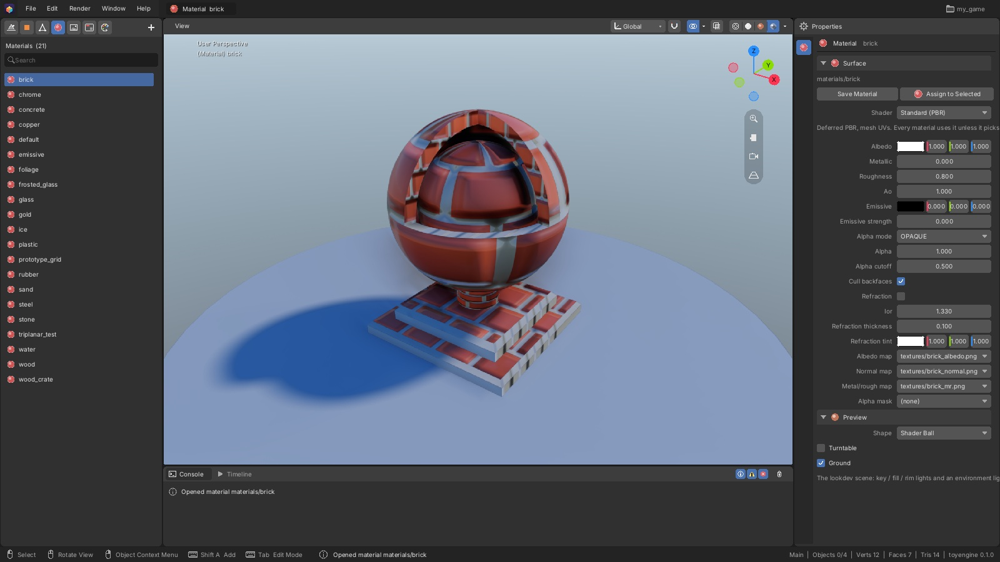

[Editor manual](README.md) > Materials and textures

A material decides how a surface looks: its colour, how shiny or metallic it is, whether it
glows or lets light through, and which textures it uses. You edit materials in the material
editor, which shows the material on a preview shape under studio lighting.

*The **brick** material open in the material editor.*

What you see:

- **Materials** in the Asset panel on the left, with the open material highlighted.
- The viewport shows the material on a preview shape, here the **Shader Ball**, standing on a
  ground disc. You can orbit and zoom, but there is nothing to select in this view.
- **Properties** on the right has one **Material** tab with two panels: **Surface**, the
  material's settings, and **Preview**, which controls the preview shape.

## Create a material

1. Open **Materials** in the Asset panel.
2. Click the **+** button.

A new grey material is created and opened, ready to edit.

You can also turn an object's own material into a reusable one: see
[Assign a material to an object](#assign-a-material-to-an-object).

Right-click a material in the Asset panel for **Open**, **Assign to Selected**, **Duplicate**,
**Rename...**, **Delete...** and **Copy Path**.

## Edit a material

1. Click the material in **Materials** in the Asset panel.
2. Change its settings in the **Surface** panel. The preview updates as you go.
3. Click **Save Material**, or press **Ctrl+S**.

The line at the top of **Surface** shows **(modified)** while there are unsaved
changes. Saving updates every object that uses the material. Press **Ctrl+Z** and
**Shift+Ctrl+Z** to undo and redo your edits. If you open another asset before saving, the
editor asks whether to save or discard your changes.

The settings, top to bottom:

| Setting | What it changes |
|---|---|
| **Albedo** | The base colour |
| **Metallic** | From 0 (plastic, wood, stone) to 1 (bare metal) |
| **Roughness** | From 0 (mirror-smooth, sharp reflections) to 1 (matte) |
| **Ao** | Darkens the surface's crevices; 1 leaves it unchanged |
| **Emissive** | The colour the surface glows with |
| **Emissive strength** | How brightly it glows; 0 is no glow |
| **Alpha mode** | **OPAQUE**: solid. **MASK**: fully solid or fully cut away, for leaves and fences. **BLEND**: see-through, like glass |
| **Alpha** | How solid the surface is, from 0 (invisible) to 1 |
| **Alpha cutoff** | With **MASK**, the point below which the surface is cut away |
| **Cull backfaces** | When ticked, the back of each face is not drawn. Untick it for thin, two-sided surfaces |
| **Refraction** | Bends what is seen through the surface, like water or thick glass |
| **Ior** | How strongly refraction bends; water is about 1.33, glass about 1.5 |
| **Refraction thickness** | How thick the refracting material appears |
| **Refraction tint** | The colour that light picks up passing through |
| **Albedo map** | A texture for the base colour |
| **Normal map** | A texture that adds surface bumps and detail without extra geometry |
| **Metal/rough map** | A texture that varies metalness and roughness across the surface |
| **Alpha mask** | A texture that cuts away parts of the surface |

Click a colour swatch to pick a colour. For the map settings, pick a texture from the list,
choose **(none)** to remove it, or drag a texture from **Textures** in the Asset panel onto the
setting.

## Choose a surface shader

The **Shader** list at the top of **Surface** chooses how the material is drawn. Most materials
use **Standard (PBR)**. The others suit special surfaces:

| Shader | Use it for | Its own settings |
|---|---|---|
| **Standard (PBR)** | Almost everything | None |
| **Triplanar** | Rock, cliffs and terrain: textures are projected from three sides, so they don't stretch and need no UVs. Solid surfaces only | **Tiling**, **Blend sharpness**, **Space** (**World** or **Object**), **Normal strength** |
| **Foliage** | Leaves and grass cards that sway in the wind. Use it with an **Alpha mask** | **Wind strength**, **Wind frequency**, **Wind dir X**, **Wind dir Y** |
| **Water** | Water surfaces, with waves, depth colour and foam | None; the object's water settings control it |

Switching shader resets the shader's own settings to their defaults. Choosing **Water** also
sets **Alpha mode** to **BLEND**, because water is always see-through.

## Preview a material

The **Preview** panel under **Surface** changes what the viewport shows. These options only
affect the preview, not the material.

| Option | What it does |
|---|---|
| **Shape** | **Shader Ball**, **Sphere**, **Rounded Cube**, **Plane** or **Cylinder** |
| **Turntable** | Slowly spins the shape |
| **Ground** | Shows or hides the ground disc |

The **Shader Ball** combines curved and flat areas, sharp edges and a shadowed hollow, so you
can judge the material on all of them at once.

## Assign a material to an object

Any of these gives a scene object a material:

- Drag the material from **Materials** in the Asset panel onto the object in the viewport.
- Select the objects, then right-click the material in the Asset panel and choose **Assign to
  Selected**. The same button is at the top of the material editor.
- Select the object and pick the material in its **Materials** tab in Properties.

The **Materials** tab shows a preview ball and the material's name. Its **Material** list
chooses where the object's material comes from:

| Choice | What it means |
|---|---|
| **Inline** | The object has its own material, edited right here with the same settings as the material editor |
| **Asset** | The object uses a shared material. Pick it under **Asset**; **Edit Material Asset** opens it in the material editor |
| **Asset + overrides** | The object uses a shared material but changes a few settings. Click **+ Override...** to choose a setting to change |

With **Asset + overrides**, later edits to the shared material still reach the object, except
for the settings it overrides. To reuse an inline material on other objects, click **Save as
Material Asset**: it becomes a new material in the Asset panel, and the object switches to
using it.

## Give each slot of a mesh a material

A mesh can be split into material slots, groups of faces that each take their own material (see
[Modeling](modeling.md#give-parts-of-a-mesh-different-materials)). When an object's mesh has
more than one slot, its **Materials** tab shows a **Slot Materials** panel:

1. Set the material for the first slot with the **Material** setting above, as usual.
2. In **Slot Materials**, find the row named after another slot.
3. Pick a material for it, or leave it at **(same as ...)** to use the first slot's material.

## View and use textures

Textures are images. **Textures** in the Asset panel lists your project's images.

- **Add a texture:** copy the image file into your project's `assets/textures/` folder. It
  appears in the list. There is no **+** button for textures.
- **Look at a texture:** click it. The viewport shows it on a flat plane, and Properties shows
  its file name and size.
- **Use a texture:** pick it in one of a material's map settings, or drag it there from the
  Asset panel. Map settings accept `.png` images.

Editing textures inside the editor is not yet available.

---
Sources: `editor/app/asset_documents.h`, `editor/app/ui/properties.inl`, `editor/app/ui/assets.inl`, `editor/app/editor_app.h`, `editor/schema/component_schema.h`, `editor/schema/inspector.h`, `editor/mesh/shader_ball.h`

Previous: [Sculpt and paint](sculpt-and-paint.md) | Next: [Animation](animation.md)
