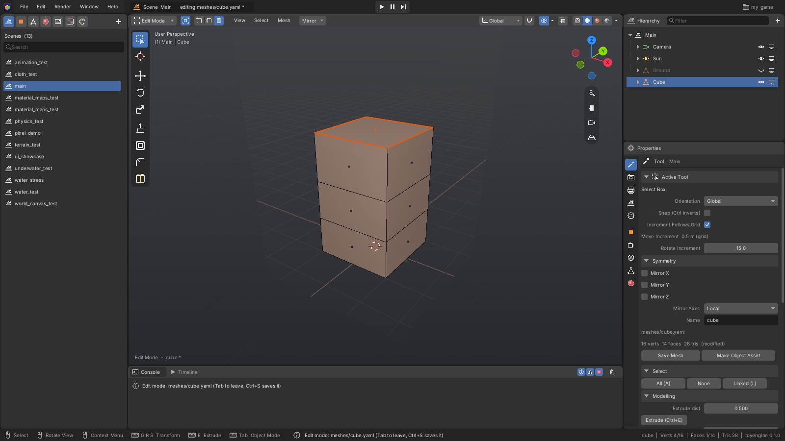
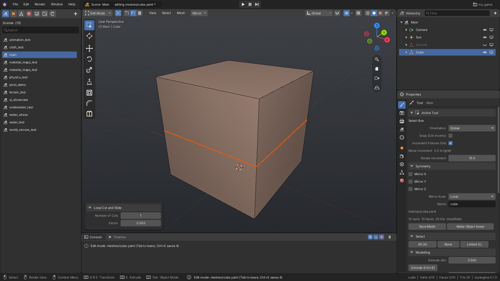

[Editor manual](README.md) > Modeling

You shape meshes in **Edit Mode**, where you work on a mesh's points, edges and faces instead of
on whole objects. You can edit a mesh on its own from the Asset panel, or straight on an object
in your scene.

*Edit Mode on a scene object. The header shows the select-mode buttons and the **Mesh** menu,
the toolbar on the left has the modelling tools, and **Properties > Tool** on the right has the
same tools as buttons with typed amounts.*

What you see in Edit Mode:

- **Vertices**, **edges** and **faces**: the points, lines and surfaces a mesh is made of.
  Selected ones are orange.
- The **mode dropdown** at the left of the viewport header (here **Edit Mode**), followed by
  three buttons that choose whether you select vertices, edges or faces.
- The **Mesh** menu in the header, which holds every modelling command.
- The toolbar down the left edge of the viewport: select, 3D cursor, move, rotate and scale,
  then **Extrude Region**, **Inset Faces**, **Bevel** and **Loop Cut and Slide**.
- **Edit Mode - cube \*** in the lower-left corner: the mesh you are editing. The **\*** means
  it has unsaved changes.
- In **Properties > Tool**: the mesh's name, its vertex, face and triangle counts, **Save Mesh**,
  and panels of tool buttons.

Moving around the viewport, and the **G**, **R** and **S** keys for moving, rotating and
scaling, work as described in [Viewport](viewport.md).

## Create a mesh

**Make a new mesh asset:**

1. Open **Meshes** in the Asset panel.
2. Click the **+** button.
3. Choose **Cube**, **Plane**, **Grid**, **Cylinder** or **Sphere**.

The new mesh is saved to your project and opened, ready to edit.

**Add a mesh object to a scene:**

1. Click **Add** in the viewport header, or press **Shift+A** over the viewport.
2. Choose **Mesh**, then a shape.

The object appears at the 3D cursor. A panel in the viewport's lower-left corner lets you change
the shape's size and detail right after adding it; see
[Adjust the last operation](#adjust-the-last-operation). Changing those values gives the object
its own mesh, so other objects of the same shape are not affected.

**Place an existing mesh:** drag it from **Meshes** in the Asset panel into the viewport, or
right-click it and choose **Add to Scene**.

Right-clicking a mesh in the Asset panel also offers **Open**, **Make Object Asset**,
**Duplicate**, **Rename...**, **Delete...** and **Copy Path**.

## Start editing a mesh

**Edit a mesh asset on its own:**

1. Click the mesh in **Meshes** in the Asset panel. The viewport shows just that mesh.
2. Press **Tab** to enter Edit Mode.

**Edit the mesh of a scene object:**

1. Select the object in the viewport or the Hierarchy.
2. Press **Tab**.

You can also choose **Edit Mode** from the mode dropdown, press **Ctrl+Tab** for the mode menu
at the mouse, or click **Edit Mesh (Tab)** in the object's **Mesh** tab in Properties. Press
**Tab** again to go back to Object Mode.

While you edit a scene object, the editor hides the other objects (lights stay) and frames the
one you are editing. The **Isolate in Edit Mode** button next to the mode dropdown turns this
off; the editor remembers your choice.

> [!WARNING]
> Editing a scene object's mesh changes the mesh itself, so every object that uses the same
> mesh changes too, in this scene and in all others. Objects made with **Add > Mesh > Cube** all
> share one cube mesh: edit one and they all change. To edit one object on its own, first
> duplicate the mesh in the Asset panel and pick the copy in the object's **Mesh** tab.

## Select vertices, edges and faces

1. Pick what to select with **1** (vertices), **2** (edges) or **3** (faces), or the three
   buttons in the header.
2. Click an element to select it.

Switching between vertices, edges and faces keeps your selection, converted to the new kind.

| To | Do this |
|---|---|
| Select one element | Click it |
| Add or remove one | **Shift**+click |
| Select an area | Drag a box (**Shift** adds, **Ctrl** removes) |
| Select an edge loop (a ring of edges running around the mesh) | **Alt**+click an edge |
| Select an edge ring (the parallel edges across a loop) | **Ctrl+Alt**+click an edge |
| Select all / none / invert | **A** / **Alt+A** / **Ctrl+I** |
| Select the connected part under the mouse | **L** |
| Select everything connected to the selection | **Ctrl+L** |

Add **Shift** to the loop and ring clicks to add to the selection. The header's **Select** menu
has the same commands.

In Solid shading you can only pick what you can see. To select through the mesh, turn on X-Ray
with **Alt+Z** or switch to Wireframe with **Shift+Z** (see [Viewport](viewport.md#see-through-surfaces-with-x-ray)).

## Extrude, inset and bevel

These tools follow the mouse after you start them:

1. Select the faces (or edges, for Bevel).
2. Press the tool's key, or click it in the toolbar or the **Mesh** menu:
   - **E**, **Extrude**: pulls the selected faces out along their direction, adding new sides.
     With edges selected, it pulls out new faces from the edges.
   - **I**, **Inset Faces**: makes a smaller copy of each face inside it.
   - **Ctrl+B**, **Bevel Edges**: rounds off the selected edges with a new strip of faces.
3. Move the mouse to set the amount.
4. Click or press **Enter** to confirm. Right-click or press **Esc** to cancel.

While a tool is running, type a number for an exact amount, hold **Ctrl** to snap, or hold
**Shift** for finer control.

To use an exact amount without the mouse, type it into **Extrude dist**, **Inset amount** or
**Bevel width** in **Properties > Tool > Modelling** and click the button next to it.

## Cut loops and slide edges

*A loop cut through a cube. The panel in the lower-left corner can still change the number of
cuts and their position.*

**Add an edge loop:**

1. Press **Ctrl+R**, or click **Loop Cut and Slide** in the toolbar.
2. Hover an edge. A yellow line previews the loop.
3. Scroll the mouse wheel, or press **+** / **-** or a digit **1** to **9**, to change the
   number of cuts. The count shows in the viewport's top-left corner.
4. Click to cut.
5. With a single cut, move the mouse to slide the new loop, then click to place it.
   Right-click leaves it in the middle.

Press **Esc** before cutting to cancel.

**Slide edges along the mesh:** select edges and press **G** twice (or choose **Edge Slide**
from the right-click menu). The edges move along the faces beside them instead of freely.

## Adjust the last operation

Some operations show a panel in the viewport's lower-left corner right after you use them. Change
a value there and the operation is redone with the new value, as if you had used it that way in
the first place.

| After | You can change |
|---|---|
| **Loop Cut and Slide** | **Number of Cuts**, and **Factor** (where a single cut sits) |
| **Subdivide** | **Number of Cuts** |
| **Subdivide Smooth** | **Levels** |
| Adding a **Grid** | **X Subdivisions**, **Y Subdivisions**, **Size** |
| Adding a **Cylinder** | **Vertices**, **Radius**, **Depth**, **Cap Fill** |
| Adding a **Sphere** | **Segments**, **Rings**, **Radius** |
| Adding a **Cube** or **Plane** | **Size** |

The panel goes away as soon as you make another change. Click its title to collapse it.

## Other mesh tools

Each of these acts on the selection. You find them in the header's **Mesh** menu, in the menu
that opens when you right-click the mesh (or press **W**), or by key:

| Tool | Key | What it does |
|---|---|---|
| **Make Face** | **F** | Fills a face between 3 or more selected vertices |
| **Duplicate** | **Shift+D** | Copies the selection, then lets you move the copy |
| **Bridge Edge Loops** | **Ctrl+E** | Joins two selected edge loops with a tube of faces |
| **Triangulate Faces** | **Ctrl+T** | Splits the selected faces into triangles |
| **Tris to Quads** | **Alt+J** | Joins pairs of selected triangles into four-sided faces |
| **Subdivide** | right-click menu | Splits the selected faces into smaller ones |
| **Subdivide Smooth** | right-click menu | Splits every face and rounds off the whole mesh |
| Delete | **X** or **Delete** | **Vertices**, **Edges** or **Faces**; or **Dissolve Vertices**, **Dissolve Edges**, **Dissolve Faces**, which remove them but keep the surface closed |
| Merge | **M** | **At Center** joins the selected vertices into one; **By Distance** joins vertices that sit on top of each other |
| Normals | **Alt+N** | **Flip** turns faces inside out; **Smooth** and **Flat** set smooth or faceted shading on the selected faces |
| Add Mesh | **Shift+A** | Adds a cube, plane, grid, cylinder or sphere into this mesh at the 3D cursor |

If a dissolve would leave a hole, the editor skips that part and says so in the Console.

To set the shading of whole objects without entering Edit Mode, select them in Object Mode,
right-click in the viewport and choose **Shade Smooth** or **Shade Flat** (also under
**Object** in the viewport header). **Smooth** blends the light across faces so a curved
surface looks round; **Flat** lights each face on its own, so its edges show. The setting is
saved in the mesh, so every object that uses that mesh changes, and **Ctrl+Z** undoes it.

## Mirror and symmetry

**Flip the selection once:**

1. Press **Ctrl+M**, or open **Mesh > Mirror** in the header.
2. Choose an axis. **X Global**, **Y Global** and **Z Global** use the world's directions;
   **X Local**, **Y Local** and **Z Local** use the mesh's own.

The selection flips around its own centre.

**Model both sides at once:** turn on **Mirror X**, **Mirror Y** or **Mirror Z** in
**Properties > Tool > Symmetry**, or with the **Mirror** button in the header. Every move,
rotate and scale is then repeated on the other side of the mesh. **Mirror Axes** chooses whether
the mirror runs through the mesh's own centre (**Local**) or the world's centre (**Global**).
Symmetry is off by default in Edit Mode.

## Unwrap UVs

UVs decide how a texture wraps around the mesh.

1. Select the faces to unwrap.
2. Press **U**, or open **Mesh > UV Unwrap** in the header.
3. Choose **Cube Projection** to project from six sides, or **Project X**, **Project Y** or
   **Project Z** to project straight along one direction.

**Box scale** in **Properties > Tool > UVs** sets how large the texture appears with **Cube
Projection**. There is no UV editor; these projections are the UV tools.

## Give parts of a mesh different materials

A mesh can be split into **material slots**: groups of faces that can each get a different
material, such as glass for a window and wood for its frame.

1. Open the mesh's **Mesh** tab in Properties and find **Material Slots**.
2. Click **Add Slot**. Each row shows the slot's colour, its name (click to rename) and how
   many faces it has.
3. Press **Tab** to enter Edit Mode and select the faces for the slot.
4. Click **Assign** on the slot's row.

**Select** on a row selects that slot's faces. **Remove Slot** moves its faces back to the first
slot. To see a material on a slot while you work, pick it under **Preview**, or drag a material
from the Asset panel onto that part of the mesh. This only colours the mesh in this view; each
object chooses its real materials in its **Materials** tab (see
[Materials and textures](materials-and-textures.md#give-each-slot-of-a-mesh-a-material)).

## Save your work and undo

**A mesh you opened from the Asset panel:** click **Save Mesh** in Properties, or press
**Ctrl+S**. A **\*** next to the mesh shows it has unsaved changes.

**A scene object's mesh:** it saves itself when you leave Edit Mode. You can also press
**Ctrl+S** at any time.

**Undo:** press **Ctrl+Z** to undo and **Shift+Ctrl+Z** to redo. Each operation is one step,
and the **Edit** menu names it, for example **Undo Extrude**. After you leave Edit Mode, **Ctrl+Z**
still steps back through your mesh changes along with your scene changes, newest first.

## Turn a mesh into an object asset

An object asset is a ready-made object you can place in any scene (see
[Scenes and objects](scenes-and-objects.md#reuse-an-object-in-many-places)).

1. Open the mesh.
2. Click **Make Object Asset** in Properties, or right-click the mesh in the Asset panel and
   choose **Make Object Asset**.

The editor saves the mesh, creates an object that uses it, and opens the new object asset.

---
Sources: `editor/mesh/edit_mesh.h`, `editor/mesh/mesh_ops.h`, `editor/mesh/mesh_loops.h`, `editor/mesh/mesh_subdivide.h`, `editor/mesh/mesh_mirror.h`, `editor/mesh/primitives.h`, `editor/app/ui/mesh_tools.inl`, `editor/app/ui/viewport_chrome.inl`, `editor/app/ui/properties.inl`, `editor/app/ui/assets.inl`, `editor/app/editor_app.h`, `editor/app/asset_documents.h`, `editor/viewport/modal_transform.h`

Previous: [Viewport](viewport.md) | Next: [Sculpt and paint](sculpt-and-paint.md)
