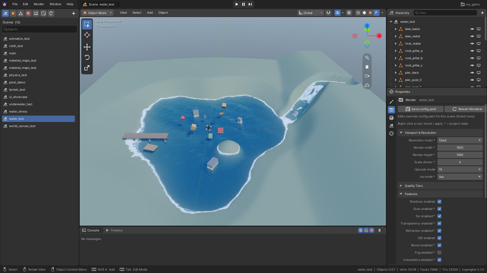
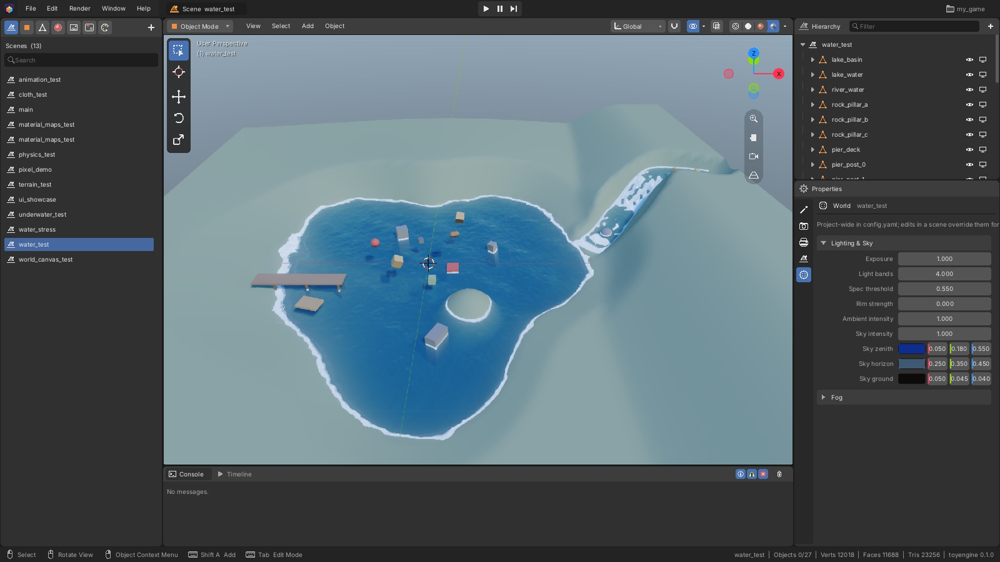
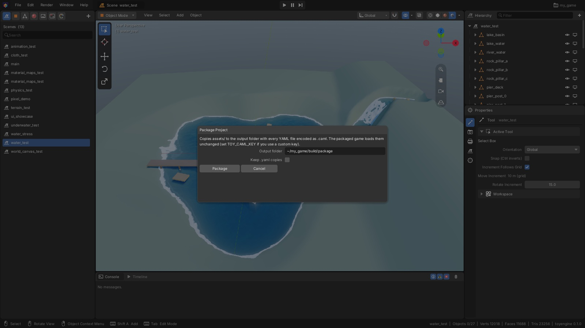

[Editor manual](README.md) > Project settings

Project settings control how your game looks and runs: render quality, sky and fog, physics,
the game window and the scene the game starts with. You change them on four tabs of
Properties, **Render**, **World**, **Output** and **Scene**, which appear while a scene is
open. This page also shows how to package the project for shipping.

*The **Render** tab. At the top are **Save config.yaml** and **Restart Renderer**, then a short
reminder of how edits are stored, then the setting groups. A `*` after a setting's name means
it takes effect only after a restart.*

## Open the settings tabs

1. Open a scene.
2. In Properties, click the **Render**, **Output**, **Scene** or **World** tab icon (the second
   to fifth icons). Hover over an icon to see its name.

You can also choose **Render > Render Settings** or **Render > World Settings** in the top bar.

Click a group's header to fold or unfold it. Drag a number left or right, or click it and
type. Most changes show in the viewport at once.

## Change a setting for one scene or for the whole project

Settings belong to the project, so every scene uses the same values. A scene can **override**
some of them for itself, for example to give one level thicker fog.

> [!NOTE]
> While a scene is open, a change on the **Render** or **World** tab, or in **Physics** on the
> **Scene** tab, applies only to that scene. The row turns tinted, with a coloured bar at its
> left edge, to show it is overridden. Settings marked `*` are the exception: they always apply
> to the whole project.

To manage an override, right-click the row:

| Item | What it does |
|---|---|
| **Revert to Project Setting** | Drops this scene's override, so the scene uses the project's value again |
| **Apply to Project Settings** | Makes this scene's value the project's value, for every scene |
| **Reset to Default** | Clears the project's value, so the built-in default applies |

## Save your settings

- Overrides are saved with the scene, when you save the scene.
- Project-wide values are saved when you click **Save config.yaml** on the **Render** or
  **Output** tab. The button shows a `*` while there are unsaved changes.
- **File > Save** (**Ctrl+S**) saves both.

To undo a settings change, point at Properties and press **Ctrl+Z**.

## Apply settings that need a restart

Settings with a `*` after their name can't change while the renderer is running. When you
change one, the Console says the change applies on restart. To apply it:

1. Click **Restart Renderer** at the top of the **Render** tab, or choose
   **Render > Restart Renderer**.

The renderer starts again with your changes. The open scene, your view and any unsaved changes
stay as they were.

## Render tab

The Render tab is organized by feature. Every section starts closed, so the tab opens as a list:

| Heading | Sections |
|---|---|
| **General** | **Resolution & Detail** (render size, upscaling, mesh detail), **Lighting & Sky** (exposure, shading style, sky colours), **Anti-Aliasing** (the method, and only that method's tuning) |
| **Render Features** | **Shadows**, **Contact Shadows**, **Ambient Occlusion**, **Reflections**, **Global Illumination**, **Transparency & Refraction**, **Fog**, **Volumetrics**, **SDF Raymarching**, **Water**, **Bloom**, **Auto Exposure**, **Depth of Field**, **Tilt Shift**, **Color Grading**, **UI Canvases** |
| **Stylize** | **Outline**, **Palette**, **Dither**, **Pixel Stability** |
| **Debug** | **Debug View**: one part of the image on its own, such as normals or shadows |

- **Turn a feature on or off** with the checkbox in its section header. Click the name to open
  the section without changing it. An open section that is off says so at the top.
- **Everything about a feature is inside its section**: its quality tier, its tuning, and the
  sizes that need a restart. Sub-headings group the rows (for Shadows: Sun Cascades, Softness,
  Contact Hardening, Bias, Point & Spot Lights, Performance). Rows that belong to one mode show
  only in that mode, such as FXAA's rows only while **Method** is **fxaa**.
- **Hover any row** for what it does and its key in config.yaml.
- **Search settings** at the top narrows the tab to matching settings as you type. It matches
  names, keys and descriptions.
- Rows marked **Set by ... Quality** in their description follow the section's **Quality** tier
  until you change them. A value you set yourself always wins over the tier.
- **Unrecognized Keys** appears only when config.yaml's `render:` holds a key the editor doesn't
  know, such as a typo.

The editor's viewport always fills its area, so **Resolution & Detail** changes the running
game's image, not the editor's view. In the same way, the viewport's shading buttons decide
what the editor shows, not **Debug view** (see [Viewport](viewport.md#change-how-the-scene-is-drawn)).

## World tab

The **World** tab holds the sky, ambient light and fog.

- **Lighting & Sky**: **Exposure**, **Ambient intensity**, **Sky intensity**, and the three sky
  colours **Sky zenith** (overhead), **Sky horizon** and **Sky ground**. Click a colour swatch
  to pick a colour, or edit its red, green and blue numbers.
- **Fog**: the fog's mode, density, colour, height and distance limits.

**Fog mode** has three choices:

| Mode | How the fog builds up |
|---|---|
| **Linear** | Evenly, from none at **Fog linear start** to full at **Fog linear end**. **Fog density** is ignored. |
| **Exponential** | Starts right away and fades out softly |
| **Exponential Squared** | Clear up close, then closes in quickly. This is the default. |

To see fog at all, turn on **Fog enabled** in **Features** on the **Render** tab and restart
the renderer.

## Output tab

The **Output** tab has **Save config.yaml** and **Package Project...** at the top, then:

- **Window**: the game window's **Title**, **Width**, **Height** and **Vsync**.
- **Jobs**: **Worker threads** (how many CPU threads the game uses; `0` uses them all) and
  **Parallel threshold**.
- **Output**: a screenshot the game can save when it closes. Turn on **Save on exit** and set
  **Filepath** to where it goes. **Save low res** saves the image at the render size instead of
  the window size.

Window and jobs settings apply the next time the game starts.

## Scene tab

Open it from the tab icon, or click the scene's name at the top of the Hierarchy.

- **Scene**: the scene's **Name**, and **Auto Transform** (on by default), which makes sure
  every object has a position, rotation and scale when the scene loads. Below them is where the
  scene is saved.
- **Startup**: **Default Scene** is the scene the game opens first, and the one the editor
  opens when it starts. Click **Use This Scene at Startup** to pick the open scene.
- **Physics**: **Gravity** (in metres per second squared, straight down is negative Z) and
  **Fixed timestep** (how often physics updates, in seconds). A scene's own values apply when
  it starts or plays.

## Build the game

**Build** turns your project into a game that runs on its own on any computer with the same
operating system: a `.app` on macOS, or a folder on Linux. Players don't need toyengine,
Homebrew or the Vulkan SDK.

1. Choose **Build > Build Settings...** once. Set the **Product name**, **Version** and
   **Bundle identifier** (for example `com.yourstudio.yourgame`), and optionally an **Icon**
   (a square PNG). Click **Save**. The settings go in `build_settings.yaml` beside your project
   file, never into the game.
2. Choose **Build > Build (Development)** to make a version you can test and share with
   testers. It builds quickly and keeps debug options available.
3. Choose **Build > Build (Shipping)** for the version players get. It recompiles the game
   optimized, encodes your assets and turns debug options off.

A **Build Project** window shows progress. When the build finishes, click **Run** to start
it, or **Show in Finder** to find it. Builds go in `build/dist/development` or
`build/dist/shipping` inside your project. **Build and Run** does a Development build and
starts it.

### Signing on macOS

A Development build is signed ad-hoc: it runs on your Mac. For other people's Macs, a
Shipping build must be signed with a **Developer ID** and notarized by Apple:

1. Install a *Developer ID Application* certificate from your Apple Developer account.
2. Run `xcrun notarytool store-credentials toy-notary` once in Terminal, and follow its
   prompts.
3. In **Build Settings**, click **Detect identities**, pick yours (or leave **auto**), and set
   **Notary profile** to `toy-notary`.

The Shipping build then signs, notarizes and staples the app, and makes a `.zip` to hand out
(and a `.dmg` if you turn that on). Without an identity it still builds, signed ad-hoc, and
the Console warns that other Macs will block it.

> [!NOTE]
> A game writes its log and crash reports to `~/Library/Logs/<bundle id>/` on macOS
> (`~/.local/state/<name>/logs` on Linux). Players' saved settings, such as volume, go in
> `~/Library/Application Support/<bundle id>/`.

## Package the assets only

Packaging copies only your project's assets, with its scene and asset files encoded so they
can't be read as plain text. There is no program in it; use [Build](#build-the-game) to make a
game you can hand out.

1. Choose **File > Package Project (.caml)...**, or click **Package Project...** on the
   **Output** tab.
2. Check **Output folder**. It starts as the `build/package` folder inside your project.
3. Turn on **Keep .yaml copies** only if you also want readable copies of the files, for
   example to track down a problem.
4. Click **Package**.

The Console reports how many files were packaged, or lists what went wrong. The output folder
holds a copy of your assets and, if the game program has been built, the game itself.

> [!TIP]
> You don't need to change anything in your scenes before packaging. The packaged game finds
> the encoded files on its own.

---

Sources: `editor/schema/settings_schema.h`, `editor/app/ui/properties.inl`, `editor/app/ui/topbar.inl`, `editor/app/editor_app.h`, `editor/core/scene_document.h`, `editor/build/packager.h`, `editor/build/build_pipeline.h`, `editor/build/build_settings.h`, `editor/app/ui/build.inl`, `editor/app/project.h`

Previous: [UI designer](ui-designer.md) | Next: [Shortcuts](shortcuts.md)
