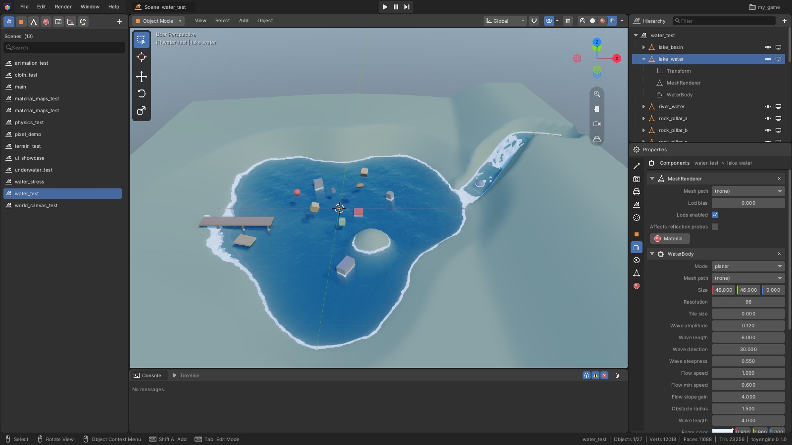
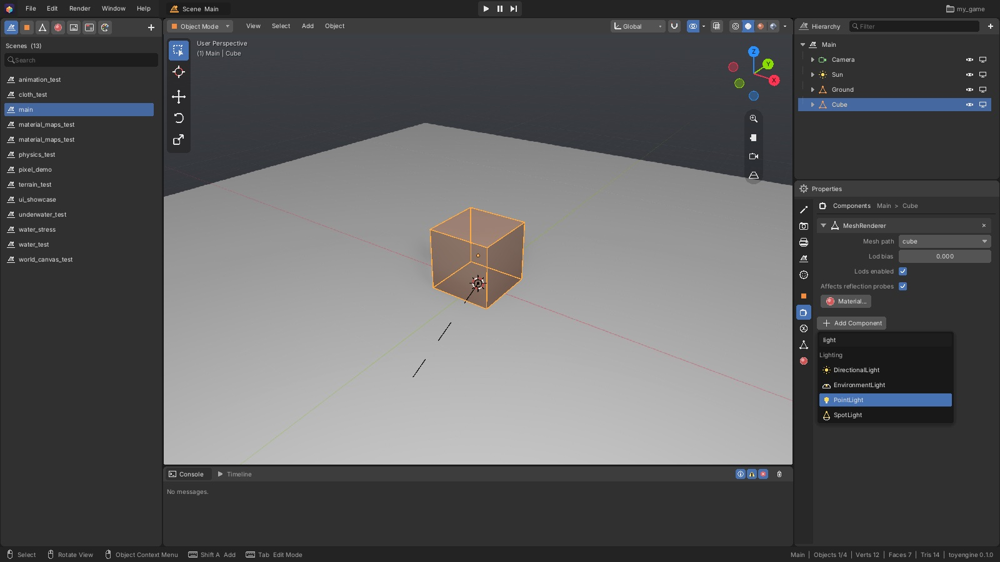
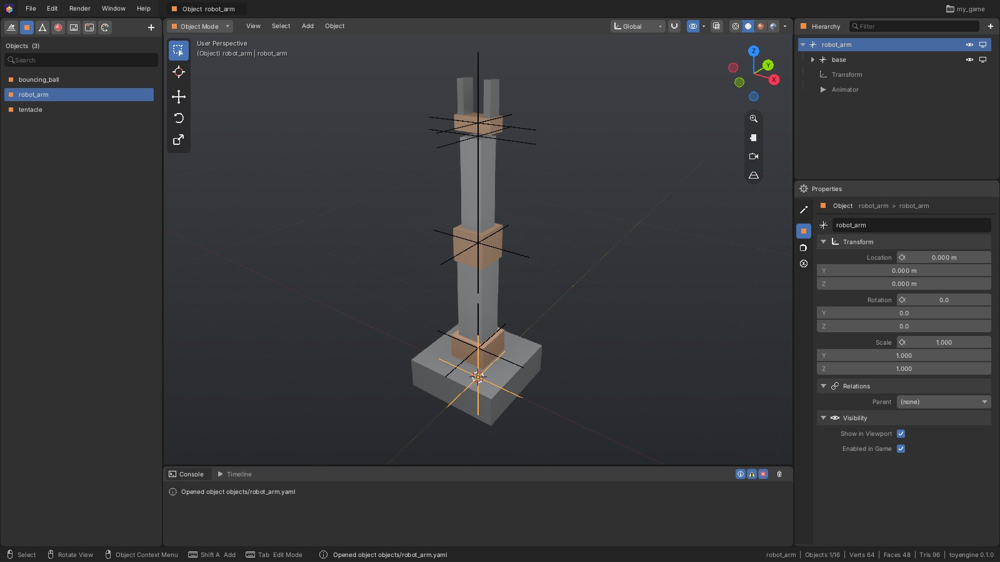

[Editor manual](README.md) > Scenes and objects

A **scene** is a level or screen of your game: a set of objects arranged in a tree. Each
**object** has a position, rotation and scale, and **components** that give it a job, such as
showing a mesh, lighting the scene or falling under gravity. This page shows how to build a
scene in the Hierarchy and Properties, reuse objects across scenes, test the scene with
**Play**, and undo mistakes.

*In the Hierarchy (top right), **lake_water** is selected and unfolded to show its components:
**Transform**, **MeshRenderer** and **WaterBody**. Properties (below it) is on the
**Components** tab and shows the settings of each one.*

## Create or open a scene

To start a new scene, do one of these:

- Choose **File > New Scene** (**Ctrl+N**). You get an unsaved scene called `untitled` with a
  `camera`, a `sun`, a `ground` plane and a `cube`. To keep it, choose
  **File > Save Scene As...** (**Shift+Ctrl+S**) and give it a name.
- Open the **Scenes** tab of the Asset panel and click **+**. The new scene has the same
  starter objects, is saved straight away and opens.

To open a scene, click it in the **Scenes** tab, or use **File > Open Scene...** (**Ctrl+O**)
or **File > Open Recent**.

To save, choose **File > Save** (**Ctrl+S**). This saves everything with unsaved changes.

To rename a scene, change **Name** on the **Scene** tab of Properties. To rename it in the
asset list, right-click it there and choose **Rename...**.

## Add an object

1. Point at the viewport and press **Shift+A**, or click **+** at the top of the Hierarchy.
2. Choose what to add:

| Item | Adds |
|---|---|
| **Mesh > Cube**, **Plane**, **Grid**, **Cylinder**, **Sphere** | A basic 3D shape |
| **Light > Sun**, **Point**, **Spot**, **Environment** | A light |
| **Camera** | A camera |
| **Particle System** | A particle effect (sparks, smoke, fire, a scatter of instances over a mesh). It plays in the viewport while you edit. While it is selected, its emission shape and the bounds of its particles are drawn in orange. |
| **Empty** | An object with nothing but a position. Useful as a parent for other objects. |
| **Reflection Probe** | A probe that captures reflections for nearby surfaces |
| **Terrain** | A terrain |

The new object appears at the [**3D cursor**](viewport.md#place-the-3d-cursor) (the small red-and-white ring in the viewport that
marks where new things go) and is selected. It is named in snake_case, like the files in
`assets/`: **Point Light** becomes `point_light`. If another object already has the name, a
number is added (`cube_001`, then `cube_002`). Names you type yourself are kept as you write them. Right after adding a shape you can change its size and detail in the
**Adjust Last Operation** panel, see [Modeling](modeling.md#adjust-the-last-operation).

You can also drag a mesh or an object from the Asset panel into the viewport.

## Select objects

| To... | In the Hierarchy | In the viewport |
|---|---|---|
| Select one object | Click its row | Click it |
| Add or remove an object | **Shift**-click, or **Cmd**-click on macOS (**Ctrl**-click elsewhere) | **Shift**-click |
| Select all / nothing | **A** / **Alt+A** | **A** / **Alt+A** |
| Zoom the view to the selection | **F** or **.** | **F** or **.** |

For the Hierarchy keys, the mouse must be over the Hierarchy. The last object you click is the
**active** object: Properties shows its settings. To find an object by name, type in the
Hierarchy's **Filter** box. More ways to select are in [Viewport](viewport.md#select-objects).

## Rename, copy or delete an object

- **Rename**: double-click the object's row, or select it and press **F2**. Type the new name
  and press **Enter**. You can also edit the name at the top of the **Object** tab.
- **Copy**: press **Shift+D** with the mouse over the viewport. The copies follow the mouse;
  click to drop them. Choosing **Duplicate** from the Hierarchy's right-click menu leaves the
  copies where the originals are.
- **Delete**: press **X** or **Delete** with the mouse over the Hierarchy. In the viewport,
  **X** asks you to confirm and **Delete** deletes at once.

Right-click a row in the Hierarchy for more commands:

| Item | What it does |
|---|---|
| **Add Child** | Adds an **Empty**, a shape or a **Point Light** under this object |
| **Add** | Adds an **Empty** or a shape at the top level |
| **Object Asset** | Places a copy of one of the project's object assets (see [Reuse an object in many places](#reuse-an-object-in-many-places)) |
| **Create Object Asset** | Turns this object into a reusable object asset |
| **Rename**, **Duplicate**, **Delete** | As above |
| **Clear Parent** | Moves the object to the top level without moving it in the world |
| **Hide**, **Show All** | Hides the selection in the viewport, or shows everything again |
| **Frame** | Zooms the viewport to the selection |

## Put an object under another (parenting)

An object placed under another, its **parent**, moves, turns and scales with it. To parent an
object, do one of these:

- In the Hierarchy, drag the object's row onto the parent's row. To move it back to the top
  level, drop it on the empty space below the rows.
- On the **Object** tab, pick the parent from **Relations > Parent**.
- In the viewport, select the objects to move, select the parent last, and press **Ctrl+P**.

To undo a parent, press **Alt+P** in the viewport and choose **Clear Parent** or
**Clear and Keep Transformation**, or use **Clear Parent** in the Hierarchy's right-click menu.

## Hide or switch off an object

Each Hierarchy row has two icons, which are also on the **Object** tab under **Visibility**:

| Icon | Setting | What it does |
|---|---|---|
| Eye | **Show in Viewport** | Hides the object while you work. Not saved, and doesn't affect the game. |
| Screen | **Enabled in Game** | Switches the object off when the game runs. Saved with the scene. The row is greyed out. |

Keys for the eye, with the mouse over the viewport or the Hierarchy: **H** hides the selection
and **Alt+H** shows everything again. In the viewport, **Shift+H** hides everything except the
selection.

## Move, rotate and scale with numbers

Select an object and open the **Object** tab (the orange square icon) in Properties.

- **Location** is in metres, **Rotation** in degrees, and **Scale** is a multiplier.
- Drag a value left or right to change it, or click it and type a number.

To move objects with the mouse instead, see [Viewport](viewport.md#move-rotate-and-scale).

## Add and edit components

1. Select the object and open the **Components** tab in Properties.
2. Click **Add Component** at the bottom.
3. Type in the search box to narrow the list, then click a component.

The component is added with ready-to-use settings. Components that an object can have only
once are left out of the list if the object already has one.

Each component is a panel. Click its header to fold or unfold it, and click its **x** to
remove it. Right-click the header for **Move Up**, **Move Down**, **Reset** (back to the
starting values), **Copy as YAML** (copies the settings as text) and **Remove Component**.

Some notes on the fields:

- A drop-down for a file, such as **Mesh path**, lists the project's matching assets, with
  **(none)** at the top.
- A list setting shows only a summary, such as **[3 items]**, and can't be changed here.
- A MeshRenderer's material is set on the **Materials** tab. The **Material...** button takes
  you there (see [Materials and textures](materials-and-textures.md#assign-a-material-to-an-object)).

Physics components (Rigidbody and the colliders) have their own **Physics** tab, which works
the same way with an **Add Physics Component** button.

### Components you can add

| Group | Components |
|---|---|
| Rendering | MeshRenderer, SkinnedMeshRenderer, Camera, SdfRenderer, SdfShape |
| Lighting | DirectionalLight, PointLight, SpotLight, EnvironmentLight, ReflectionProbe |
| Physics | Rigidbody, BoxCollider, SphereCollider, CapsuleCollider, MeshCollider |
| Water | WaterBody, Buoyancy |
| Audio | AudioSource, AudioListener, VolumeBinding (see [Sounds](#add-sound)) |
| Gameplay | CameraController, KinematicMover, FreeMover, KinematicController |
| World | Terrain |
| Animation | Animator (see [Animation](animation.md#make-an-object-animatable)) |
| UI groups | The game UI components (see [UI designer](ui-designer.md#element-settings)) |

An object can have more than one PointLight, SpotLight, ReflectionProbe, SdfShape or collider,
but only one of each other component.

## Add sound

1. In the **Asset** panel, open the **Audio** tab and click **+** to import a `.wav` or `.mp3`.
   It's copied into `assets/audio/`.
2. Click the sound to open it. In Properties, **Preview** plays it. **Import Settings** set its
   default volume, pitch, looping and bus. Turn on **Force Mono** for a sound that should come
   from a place in the world. Click **Save Import Settings**.
3. Select an object, add an **AudioSource** component and pick the sound as its **Clip**.
   **Play on start** plays it when the game starts. Turn on **Spatialize** to hear it from the
   object's position.

The main camera hears the game. Add an **AudioListener** to an object (a player character,
for example) to hear from there instead. Sounds play only while the game runs (**Play**),
never while you edit.

## Reuse an object in many places

*An object asset open for editing. The **Objects** tab of the Asset panel lists the project's
object assets; **robot_arm** is open, with its child **base** and its **Animator** component in
the Hierarchy.*

An **object asset** is an object, with its children and components, saved on its own so you
can place it in many scenes. Each placed copy is an **instance**. When you change the object
asset, every instance changes too.

### Make an object asset

Do one of these:

- Right-click an object in the Hierarchy and choose **Create Object Asset**. The object is
  saved as an object asset and replaced by an instance in the same place.
- Right-click a mesh in the Asset panel and choose **Make Object Asset**.
- Click **+** on the **Objects** tab of the Asset panel for an empty one.

### Edit an object asset

1. Open the **Objects** tab of the Asset panel.
2. Click the object asset.

It opens on its own, lit by simple studio lights that aren't saved with it. Add children and
components as you would in a scene. An object asset can't contain an instance of itself.

### Place an instance

- Drag the object asset from the **Objects** tab into the viewport. It lands on the ground
  under the mouse.
- Or right-click it and choose **Place in Scene**, or choose **Object Asset > <name>** from the
  Hierarchy's right-click menu.

### Change one instance

Instances have a link icon in the Hierarchy. When you select one, the **Components** tab shows
an **Instance of <name>** bar with an **Open** button that opens the object asset.

1. Select the instance and open the **Components** tab.
2. Change a setting.

Only that instance changes, and the component's header reads **(override)**. To go back to the
object asset's value, right-click the header and choose **Revert Override**. Child objects that
come from the object asset are dimmed in the Hierarchy; open the object asset to change them.

## Test the scene with Play

The **Play**, **Pause** and **Step** buttons sit in the centre of the top bar while a scene is
open.

1. Click **Play** or press **F5**. The game starts from the scene as it is now.
2. Click in the viewport to give the game your keyboard and mouse.
3. Press **Esc** to get the mouse back for the editor. The game keeps running.
4. Click **Stop** (the same button) or press **F5** to end the game.

**Pause** freezes the game and resumes it. **Step** moves a paused game on by one frame; if
the game isn't running, it starts paused.

While the game runs, the viewport header changes colour and the status bar shows **PLAYING**.

> [!NOTE]
> You can't edit the scene while it plays. When you stop, the scene is exactly as it was before
> you pressed **Play**.

## Undo a mistake

Press **Ctrl+Z** to undo and **Shift+Ctrl+Z** or **Ctrl+Y** to redo. **Edit > Undo** shows the
name of the change it will undo. Dragging a value or an object counts as one change.

Undo works on what you are doing at the moment:

| If you are... | **Ctrl+Z** undoes |
|---|---|
| In Edit Mode, Sculpt Mode or a Paint mode | Changes to the mesh |
| Pointing at the Timeline, or recording keys | Changes to the animation |
| Editing a material | Changes to the material |
| On the **Theme** tab, pointing at Properties | Changes to the game UI theme |
| On **Render**, **Output** or **World**, pointing at Properties | The last settings change |
| Anywhere else | Changes to the scene or object asset |

In Object Mode, mesh changes you made in Edit Mode can still be undone after you leave it.

---

Sources: `editor/app/ui/properties.inl`, `editor/app/ui/outliner.inl`, `editor/app/ui/assets.inl`, `editor/app/ui/topbar.inl`, `editor/app/ui/viewport_chrome.inl`, `editor/schema/component_schema.h`, `editor/schema/inspector.h`, `editor/core/scene_document.h`, `editor/core/undo.h`, `editor/app/editor_app.h`

Previous: [Interface](interface.md) | Next: [Viewport](viewport.md)
