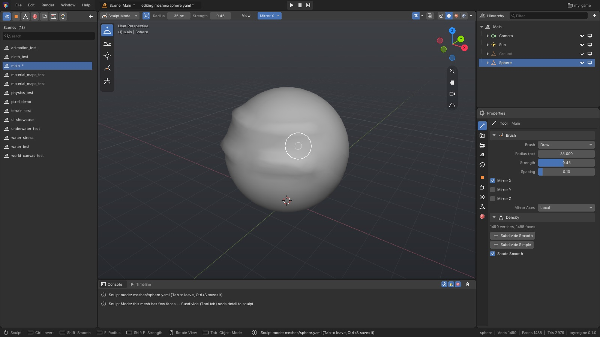
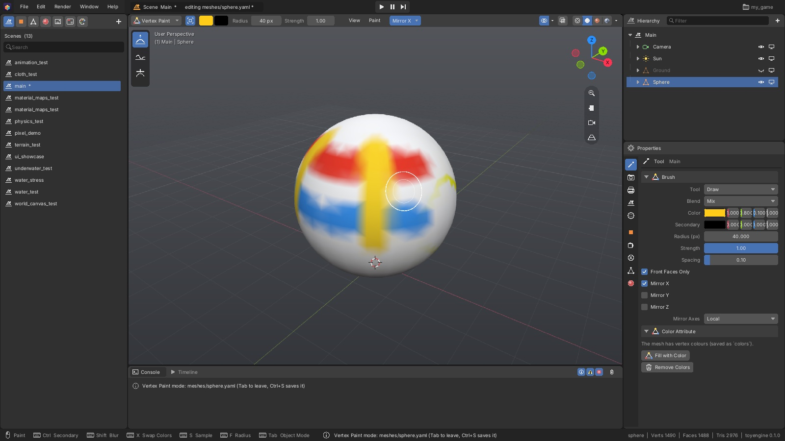
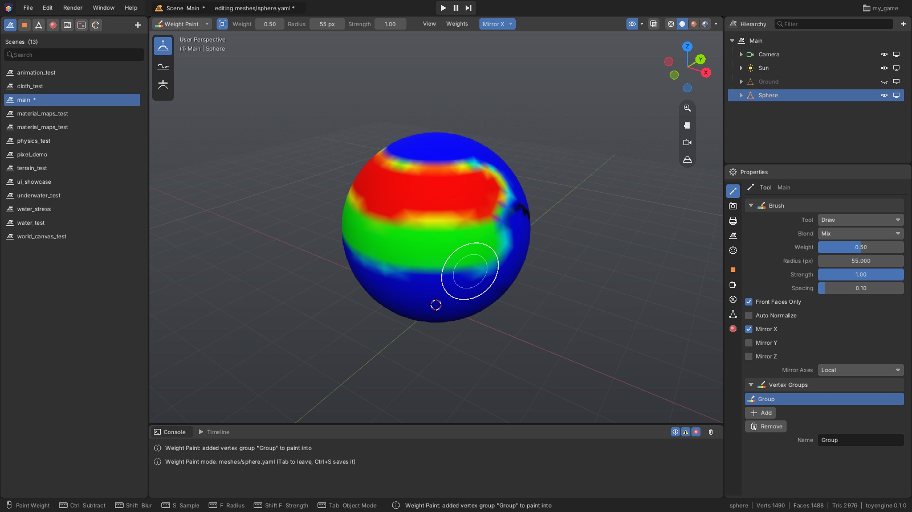

[Editor manual](README.md) > Sculpt and paint

Besides Edit Mode, a mesh has three brush modes. **Sculpt Mode** pushes and pulls the surface
like clay, **Vertex Paint** paints colour onto the mesh, and **Weight Paint** paints how strongly
each part of the mesh belongs to a vertex group. In all three you drag the brush across the
mesh.

*Sculpt Mode. The header shows the brush **Radius** and **Strength** and the **Mirror X**
button, the toolbar on the left lists the brushes, and **Properties > Tool** holds the brush
settings and the **Density** panel.*

The white circle is the brush. It lies on the surface under the mouse, and the inner ring shows
the brush strength. Like Edit Mode, the brush modes change the mesh itself, so every object that
uses the same mesh changes too (see [Modeling](modeling.md#start-editing-a-mesh)).

## Enter and leave a brush mode

1. Select a mesh object in the scene, or open a mesh from the Asset panel.
2. Open the mode dropdown at the left of the viewport header, or press **Ctrl+Tab** over the
   viewport.
3. Choose **Sculpt Mode**, **Vertex Paint** or **Weight Paint**.

Press **Tab** to go back to Object Mode. Right-clicking in the viewport while in a brush mode
also opens the mode menu.

In a brush mode you can still move the view as usual, and **Alt**+drag moves the view instead
of painting.

## Change the brush size and strength

All three modes share these controls:

| To | Do this |
|---|---|
| Resize the brush | Press **F**, move the mouse, then click. Or drag **Radius** in the header |
| Change the strength | Press **Shift+F**, move the mouse, then click. Or drag **Strength** in the header |
| Cancel a resize | Right-click or **Esc** |

The radius is measured on screen, so the brush covers more of the mesh when you zoom out.
**Properties > Tool > Brush** also has **Spacing**: how far apart the brush dabs are along a
stroke. Smaller values give smoother strokes.

## Sculpt

1. Pick a brush in the toolbar or by its key.
2. Drag across the mesh.

| Brush | Key | What it does |
|---|---|---|
| **Draw** | **X** | Raises the surface. Hold **Ctrl** to dig in |
| **Smooth** | **S** | Evens out bumps |
| **Inflate** | **I** | Puffs the surface outward. Hold **Ctrl** to shrink it |
| **Grab** | **G** | Drags the part under the brush along with the mouse |
| **Flatten** | **Shift+T** | Presses the surface flat |

Hold **Shift** with any brush to smooth for that stroke. While you sculpt with **Ctrl** held,
the brush circle turns blue.

> [!TIP]
> Sculpting needs lots of small faces to work with. If the mesh has few, the Console says so.
> Click **Subdivide Smooth** in **Properties > Tool > Density** once or twice before you start.

The **Density** panel shows the mesh's vertex and face counts and has:

- **Subdivide Smooth**: splits every face into smaller ones and rounds off the shape.
- **Subdivide Simple**: splits every face without changing the shape.
- **Shade Smooth**: smooth shading when ticked, faceted when not.

The subdivide buttons are greyed out once the mesh would get too heavy (600,000 faces).

## Paint with symmetry

Each stroke can be repeated on the opposite side of the mesh, so you only sculpt or paint one
half. Turn axes on with the **Mirror** button in the header (it shows the active axes, such as
**Mirror X**) or the **Mirror X**, **Mirror Y** and **Mirror Z** boxes in
**Properties > Tool > Brush**. **Mirror Axes** chooses whether the mirror runs through the
mesh's own centre (**Local**) or the world's centre (**Global**).

**Mirror X** is on by default in all three brush modes. Each mode remembers its own setting.

## Paint vertex colours

*Vertex Paint. The two swatches in the header are the brush colour (yellow) and the secondary
colour (black).*

1. Click the first colour swatch in the header and pick a colour.
2. Drag across the mesh to paint.

| To | Do this |
|---|---|
| Paint with the main colour | Drag |
| Paint with the secondary colour | **Ctrl**+drag |
| Blur colours for one stroke | **Shift**+drag |
| Swap the two colours | **X** |
| Pick up the colour under the mouse | **S** |
| Fill the whole mesh with the main colour | **Shift+K** |

The toolbar has three tools: **Draw** paints, **Blur** blends neighbouring colours, and
**Average** evens out everything under the brush.

In **Properties > Tool > Brush**:

- **Blend** sets how new paint combines with what's there: **Mix**, **Add**, **Subtract**,
  **Multiply**, **Lighten** or **Darken**.
- **Front Faces Only** (on by default) stops paint from reaching the far side of thin parts.

A mesh starts with no colours; your first stroke adds them, starting from white. While you
paint, the mesh shows its colours clearly, and its normal material comes back when you leave
the mode. To start over, use **Remove Colors** in the **Color Attribute** panel or the header's
**Paint** menu, which also has **Invert**.

## Paint weights

*Weight Paint. Red means a weight of 1, blue means 0. The **Vertex Groups** panel lists the
mesh's groups, with **Group** active.*

A **vertex group** is a named set of vertices, each with a weight from 0 to 1. Weight Paint
paints the weights of the active group.

1. Click a group in **Properties > Tool > Vertex Groups** to make it active. If the mesh has
   none, your first stroke creates one called **Group**.
2. Set **Weight** in the header to the value you want to paint.
3. Drag across the mesh.

| To | Do this |
|---|---|
| Paint the weight | Drag |
| Remove weight | **Ctrl**+drag |
| Blur weights for one stroke | **Shift**+drag |
| Pick up the weight under the mouse | **S** |
| Set the weight on the whole mesh | **Shift+K** |

The tools are the same **Draw**, **Blur** and **Average**, and **Front Faces Only** works the
same way. **Blend** offers **Mix**, **Add** and **Subtract**. Tick **Auto Normalize** to keep
each vertex's weights across all groups adding up to 1. The header's **Weights** menu has
**Normalize All** and **Clear Group**, which sets the active group's weights to 0.

## Manage vertex groups

The **Vertex Groups** panel in **Properties > Tool** appears in Weight Paint and in Edit Mode.

- **Add** creates a group and makes it active.
- **Remove** deletes the active group.
- **Name** renames the active group.

In Edit Mode you can also set weights by selection:

1. Select vertices.
2. Set **Weight** in the panel.
3. Click **Assign**.

**Remove from Group** sets the selected vertices' weight to 0, and **Select** selects the
group's vertices.

## Undo and save

Each stroke is one undo step; press **Ctrl+Z** to undo and **Shift+Ctrl+Z** to redo. The
**Edit** menu names the step, for example **Undo Sculpt Draw**.

A scene object's mesh saves itself when you leave the brush mode. A mesh opened from the Asset
panel is saved with **Save Mesh** or **Ctrl+S**. See
[Save your work and undo](modeling.md#save-your-work-and-undo).

---
Sources: `editor/mesh/sculpt.h`, `editor/mesh/paint.h`, `editor/mesh/mesh_mirror.h`, `editor/app/ui/sculpt.inl`, `editor/app/ui/paint.inl`, `editor/app/ui/viewport_chrome.inl`, `editor/app/editor_app.h`, `editor/app/asset_documents.h`

Previous: [Modeling](modeling.md) | Next: [Materials and textures](materials-and-textures.md)
